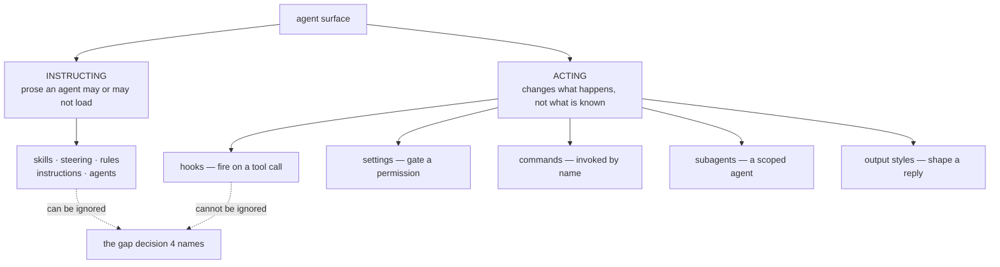

<!-- COMPONENTS-START — GENERATED from records/README.md's OWNERSHIP and DESCRIBES tables by scripts/gen-components.py. Do not edit by hand: change the table, then run `python scripts/gen-components.py --write`. -->

**Owns** — the components this record decides:

- [`.claude/hooks/fux-index-hint.sh`](../.claude/hooks/fux-index-hint.sh) · file

<!-- COMPONENTS-END -->

# SR-AGENT-SURFACES — what an agent surface is

## §1 — For humans

**An agent surface is any file fux writes into a consumer's repository that an
AI coding agent reads or runs.** Until today the repo shipped five kinds of
them and had no word for the set — `CLAUDE.md` said *agent-steering files*,
[SR-AGENT-POLICY](0132_agent-policy.md) said *vendor surfaces*, and
`docs/GLOSSARY.md` defined neither. Two names for one thing is how a third gets
invented.

**The word is *agent surface*** (Arpit, 2026-09-14).

The taxonomy that matters is not *which vendor* — that is
SR-AGENT-POLICY's job — but **what the surface does when an agent meets it**.



<details>
<summary><b>ASCII twin</b> — the same diagram, for terminals, diffs, and any reader without a Mermaid renderer</summary>

```text
                        agent surface
                              |
          +-------------------+-------------------+
          |                                       |
     INSTRUCTING                               ACTING
 prose an agent may or                changes what HAPPENS,
   may not ever load                  not what is known
          |                                       |
  skills · steering ·                  hooks     -> fire on a tool call
  rules · instructions                 settings  -> gate a permission
  · agents                             commands  -> invoked by name
          |                            subagents -> a scoped agent
          |                            styles    -> shape a reply
          |                                       |
   CAN be ignored  ..................  CANNOT be ignored
                    the gap decision 4 names
```
</details>

**Why the split earns its keep.** An instructing surface is a request. Twenty-two
of them in this repo asked agents to search the index before grepping, and
nothing measured whether one ever did. An acting surface does not ask. That is
more power, and decision 4 is the bound on it.

## §2 — For agents

### Context

`fux setup` writes 60-odd files into four vendors' directories. Every one of
them was prose. The roster had grown to five document kinds without anyone
naming the category, and the two existing names disagreed — the condition
[SR-LAW-0](0002_LAW-0-authority.md) exists to prevent, one level up from the
rules it governs.

Separately, three surfaces that *act* rather than instruct were already
reachable and unshipped, and one surface fux **does** ship was uncounted: the
MCP tool and parameter descriptions in `src/fux/mcp.py`, which are the entire
instruction when a client connects over MCP and there is no skill file at all.

### Decision

**1. The word is *agent surface*.** Every artifact fux writes for an agent to
read or run. `CLAUDE.md`'s *agent-steering files* and SR-AGENT-POLICY's *vendor
surfaces* are the same thing and both defer here. `docs/GLOSSARY.md` carries the
definition once.

**2. Surfaces are classified by what they DO, not by vendor.**

| class | kinds | an agent meets it by |
|---|---|---|
| **instructing** | skills · steering · rules · instructions · agents | loading prose, if it loads it at all |
| **acting** | hooks · settings · commands · subagents · output styles | the surface firing, gating, or being invoked |
| **protocol** | MCP tool + parameter descriptions | connecting — **no file is involved** |
| **emitted** | CLI output: errors, `--why`, `doctor` rows, the confidence block | reading what a command just printed |

⚠ **The last two rows are the ones nobody counts.** Protocol has no file, so no
roster test sees it. Emitted output is read *at the moment an agent is stuck*,
which is when instruction actually lands — and it is the busiest surface fux
has.

**3. The five acting surfaces ship, Claude first.** `CLAUDE_SURFACES` in
`setup.py`: a `PreToolUse` hook, a seeded `settings.json`, three commands
(`/fux-search`, `/fux-answer`, `/fux-verify`), a `fux-researcher` subagent, and
an `fux-cited` output style.

🔴 **3a. CORRECTED 2026-09-14, hours after this record was accepted. Veto
condition 1 fired immediately, and the claim it killed was mine.** Decision 3
originally read *"and they are Claude-only… no other vendor fux ships to has an
equivalent"*. **That was asserted from memory and never checked. It is false for
all three other vendors**, and Arpit caught it by asking for the research the
claim should have rested on:

| vendor | hooks | commands | subagents | repo-level & committed |
|---|---|---|---|---|
| **Claude** | `.claude/hooks/` + `settings.json` | `.claude/commands/*.md` | `.claude/agents/*.md` | yes |
| **Codex** | **`.codex/hooks.json`** or `.codex/config.toml` — `PreToolUse`, `PostToolUse`, `UserPromptSubmit`, `SessionStart/End`, `SubagentStart/Stop`, … | ⚠ **user-level only** — `~/.codex/prompts/`, explicitly *"not shared through your repository"* | **`.codex/agents/`** | hooks and subagents **yes**; prompts **no** |
| **Kiro** | **`.kiro/hooks/*.json`** — 12 triggers incl. `PreToolUse`, `PostFileSave`, `AgentStop` | — | **`.kiro/agents/`** (`.json` or `.md`+frontmatter; `tools`, `model`, `permissions`, `resources`) | yes |
| **Copilot** | — | **`.github/prompts/*.prompt.md`** (`description`, `argument-hint`, `agent`, `model`, `tools`) | **`.github/agents/*.md`** or `*.agent.md`, versioned by commit SHA, works in IDE + CLI + cloud | yes |

**What actually survives of decision 3:** *output styles* are Claude-only, and
*Codex slash-prompts cannot be shipped by fux at all* — they live outside the
repository by design, which is a real bound rather than an assumed one.
Everything else was an **omission**, not a boundary.

**3b. The omission is CLOSED — eight renderings, same day.** `KIRO_SURFACES`,
`CODEX_SURFACES` and `COPILOT_SURFACES` join `CLAUDE_SURFACES` in `setup.py`:

| vendor | what ships now |
|---|---|
| **Kiro** | `.kiro/hooks/fux-index-hint.json` + its script · `.kiro/agents/fux-researcher.md` |
| **Codex** | `.codex/hooks.json` (**co-owned**) + its script · `.codex/agents/fux-researcher.md` |
| **Copilot** | `.github/prompts/fux-{search,answer,verify}.prompt.md` · `.github/agents/fux-researcher.md` |

**One body, four frontmatters.** The researcher subagent ships to all four
vendors from one shared body — the policy block included — with vendor-native
frontmatter only. That is decision 15b's device (one body, N renderings)
applied to an acting surface, and it is why
`test_there_are_renderings_to_check` went from 6 to **9**: every subagent
carries the archived-results block, because every one of them returns cited
results.

⚠ **`.codex/hooks.json` joins `CO_OWNED_SURFACES`.** It is a whole-file config
a consumer may already own, exactly like `.claude/settings.json` — same
seed-never-overwrite rule, same drift exemption, same test.

⚠ **One test had to be NARROWED, and the narrowing is the finding.**
`test_codex_and_copilot_write_the_one_directory_codex_reads` asserted nothing
under `.codex/` is ever written. That was veto 3 firing on `.codex/skills`, a
path Codex's docs no longer list — it never said anything about
`.codex/hooks.json` or `.codex/agents/`, which **are** documented. A ban on a
vendor's whole directory read as a finding when it was only ever a finding
about one path inside it.

⚠ **The lesson is the one this record was written about.** SR-AGENT-POLICY
decision 3 already said adding a vendor is *"a template plus a rendering plus a
row, not a new decision"*. I wrote a scope bound where the register already had
a mechanism, and stated it as a property of the world rather than as a thing to
check. **A record that asserts what other vendors do not have must cite where it
looked.** This one now does.

**4. 🔴 An acting surface may enforce only where the rule is EXACT.** The hook
is **advisory and exits 0 always**. Blocking `grep` would break every
legitimate use of it — reading code, counting matches, checking a log — to
serve a suggestion. *"You might have wanted fux here"* is a guess, and a guess
may not hold a veto over somebody's tool call.

**5. A hook is written executable or it does nothing.** `EXECUTABLE_SURFACES`,
`0o755` at write time. A hook at `0644` fails **silently**: the runner reports
nothing and the hint never appears.

**6. 🔴 A surface the consumer CO-OWNS is seeded, never overwritten — and
cannot be byte-pinned.** `CO_OWNED_SURFACES` is `.claude/settings.json` today.
It follows [SR-AGENT-POLICY](0132_agent-policy.md) decision 6's `AGENTS.md`
pattern: written when absent, announced as a snippet when present. It is
**exempt from the template-drift test**, and the exemption is a finding rather
than a waiver — *this repository's own* `settings.json` carries the deny rules
that keep the sealed golden answer key out of a model's context, plus five
hooks with nothing to do with fux. A setup that overwrote it would silently
remove that guard. What is asserted instead: the template parses as JSON, and
an existing file survives untouched.

**7. Rules files carry no search guidance, deliberately.** `rule-*` are
path-scoped to fux's own committed files (`sources`, `decoder`, `enrich`,
`fetcher`, `pii`, `config`, `index`). They fire when an agent edits those
files, never when it searches, and SR-AGENT-POLICY decision 15b caps them at
1200 bytes as pointers.

### Consequences

- **The five acting surfaces are opt-out with everything else** — `--no-agents`
  and `install = []` write none of them, and each is named in `setup`'s output
  (SR-AGENT-POLICY veto 1).
- **The hook's blast radius is one message on stderr.** It self-limits twice:
  it returns early unless `.fux/index` exists, and it never blocks.
- ⚠ **Nothing measures whether any instructing surface is ever loaded.** This
  record names the gap and does not close it. The honest statement is that fux
  ships 60-odd requests and zero observations of compliance.
- ⚠ **The protocol surface is unpinned.** `mcp.py`'s descriptions duplicate the
  skills' guidance with no test comparing them, so they can drift exactly the
  way `fux-decoder`'s rendering drifted from its template in `fa47760`. That is
  strike one in a known shape; a second occurrence is a gate.
- ⚠ **The emitted surface carries none of this guidance yet.** *"No confident
  matches."* could name the vocabulary gap and the retry; it does not.

### Alternatives considered

| option | why not |
|---|---|
| **Call them *steering files*** | "steering" is already one KIND (Kiro's). A category that shares a name with one of its members cannot be reasoned about. |
| **Merge into the consumer's `settings.json`** | Additive JSON merge is implementable and still wrong: it edits a file whose other keys fux does not understand, and the failure mode is silent. Decision 6's seed-or-announce has a precedent in this repo and no silent branch. |
| **A blocking `grep` hook** | Rejected under decision 4. It would be fux deciding it knows the caller's intent better than the caller, on a guess, with no way to appeal. |
| ~~**Render the five to every vendor** — "there is nothing to render into"~~ | 🔴 **WITHDRAWN 2026-09-14: the premise was false.** `.kiro/hooks/` is a real directory with a real runner and twelve triggers. So are `.codex/hooks.json`, `.codex/agents/`, `.kiro/agents/`, `.github/prompts/` and `.github/agents/`. The row is kept struck through rather than deleted, because a future session reaching for this argument should see that it was tried and did not survive contact with the documentation. |
| **Skip the output style** (my recommendation) | Overruled by Arpit, 2026-09-14, who asked for the complete set. Recorded because the dissent is cheap to keep and the file costs nothing. |

### Reference

- [SR-AGENT-POLICY](0132_agent-policy.md) decisions 5, 6, 10, 15, 16 — the
  vendor roster, opt-out, announcement, and agreement-by-construction this
  record extends rather than replaces.
- [SR-EXPAND](0149_expand.md) — the worked case for why an instructing surface
  is not enough: `--expand` shipped with a guide that never said who writes it.
- [SR-MCP](0136_mcp.md) — the protocol surface named in decision 2.
- **Vendor documentation, read 2026-09-14** — the evidence behind decision 3a,
  cited because the claim it replaced had none:
  Kiro hooks <https://kiro.dev/docs/hooks/> ·
  Kiro custom agents <https://kiro.dev/docs/custom-agents/configuration-reference/> ·
  Codex hooks <https://learn.chatgpt.com/docs/hooks> ·
  Codex custom prompts, user-level only <https://developers.openai.com/codex/custom-prompts> ·
  Copilot prompt files <https://code.visualstudio.com/docs/copilot/customization/prompt-files> ·
  Copilot custom agents <https://docs.github.com/en/copilot/reference/custom-agents-configuration>
- `tests/test_setup_agents.py` — `test_co_owned_surface_is_never_written_over`,
  `test_co_owned_surface_template_is_valid_json`,
  `test_the_hook_surface_is_written_executable`.

### Veto condition

**Reopen when any of these becomes true:**

1. ✅ **FIRED 2026-09-14, same day, before a line of it was committed.** Codex,
   Kiro and Copilot all ship repo-level acting surfaces (decision 3a's table).
   The Claude-only scope was an omission, exactly as this condition predicted.
   **It is not re-armed as written** — the remaining scope question is narrower:
   whether fux renders into the eight surfaces now known to exist, which is a
   build item, not a decision. What replaces it: *a vendor ships an acting
   surface kind absent from decision 3a's table.*
2. The advisory hook is measured to change agent behaviour **not at all** on a
   real repository — an acting surface that acts on nothing is prose with a
   shebang, and should be deleted rather than kept for tidiness.
3. `mcp.py`'s descriptions are found to disagree with the skills' — the second
   strike, and the gate belongs in the change that finds it.
