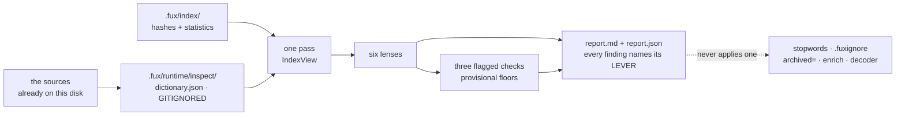

<!-- COMPONENTS-START — GENERATED from records/README.md's OWNERSHIP and DESCRIBES tables by scripts/gen-components.py. Do not edit by hand: change the table, then run `python scripts/gen-components.py --write`. -->

**Owns** — the components this record decides:

- [`src/fux/inspect/`](../src/fux/inspect) · dir

<!-- COMPONENTS-END -->

# SR-INSPECT — what the index looks like, said out loud

## §1 — For humans

**`fux doctor` tells you whether the machine is set up. `fux inspect` tells you
whether the index is any good.** They are different questions with different
remedies: `doctor`'s finding is fixed by a command or a config edit,
`inspect`'s by a change to the corpus — a stopword, an `archived=`, a decoder,
an enrichment. That is why this is a verb and not a flag.

**It is descriptive, and that is the design rather than a limitation.** Six
lenses print numbers and named lists. Exactly three numbers carry a flag, and
every one of those three says *provisional* on the line it prints. There is no
one-number index score, for the same reason the confidence band refuses to be
one number: it would be the figure everybody quotes and the one nobody can act
on.

**The words are the hard part.** The committed index holds 8-byte term hashes,
not words — a deliberate privacy property — so *"`tldr` is on every document"*
is unanswerable from the index alone. `inspect` re-tokenises the sources that
are already on this disk, with the same analyzer, into a **gitignored**
hash → word dictionary under `.fux/runtime/inspect/`. Nothing new is committed,
nothing is fetched, and the report is byte-identical run to run.



<details>
<summary><b>ASCII twin</b> — the same diagram, for terminals, diffs, and any reader without a Mermaid renderer</summary>

```text
  .fux/index/ ------------+
  hashes + statistics     |
                          v
  the sources --> dictionary.json --> IndexView --> six lenses --+--> report.md
  on this disk    GITIGNORED           one pass                  |    report.json
                                                                 +--> three checks
                                                                      (provisional)
                                          every finding NAMES a lever
                                          and APPLIES none:
                                          stopwords . .fuxignore
                                          archived= . enrich . decoder
```

</details>

### Examples

```console
$ fux inspect --retrieval-sample 25 --top 10
# `fux inspect` — the index, as it is

1179 document(s) · 26749 distinct term(s) · 457919 posting(s) · 5708 edge(s)

**Read-only.** Every finding below names the lever that would change it, and applies none.

## Checks — four numbers, three of which carry a flag

| check | value | floor | status | what it means |
|---|---|---|---|---|
| unreachable share | 0.1 % | <= 0.01 *(provisional)* | ok | 1 of 1179 documents carry no distinctive term at all, so no query can select them (EXHAUSTIVE - every document was checked) |
| boilerplate share | 7.2 % | <= 0.60 *(provisional)* | ok | 33027 of 457919 postings carry one of 46 term(s) on half the corpus or more |
| near-duplicate share | 13.4 % | <= 0.20 *(provisional)* | ok | 158 of 1179 documents are one half of a near-duplicate pair (Jaccard >= 0.80); 231 pair(s) |
| findable share | 100.0 % | — *(descriptive: no floor separates a healthy corpus from a bad one)* | descriptive | 25 of 25 documents are returned in the top 3 for their own most distinctive words (an evenly spaced SAMPLE - the share is an estimate) |

… 120 lines omitted …

| word | df | share | idf |
|---|---|---|---|
| `2026` | 1016 | 86 % | 0.15 |
| `md` | 990 | 84 % | 0.18 |
| `work` | 969 | 82 % | 0.20 |
```

Captured on this repository at `91255adb`. The top-`df` row is the *"TLDR is
everywhere"* case Arpit asked for, on a real corpus: `2026` is on 86 % of these
documents and scores almost nothing.

---

## §2 — For agents

### Context

**Arpit, 2026-09-13:** *"I need some kind of tool to analyse the index that is
consumed: is it a good index or a bad index?"* Three related questions came with
it — which words are on every document, whether documents produce similar index
shapes, and whether the result is good.

Nothing answered any of them. `fux doctor` answers *is this repository set up*;
`fux ask --why` answers *why did this one document rank*; the benchmark answers
*how well does the engine do on a graded corpus*. Between the three there was no
way to look at a corpus and see its shape — and the M1 pruning gate is the
standing proof that this matters: k=128 pruning returned a zero delta on three
eval corpora because their documents' **median vocabulary is 32–46 distinct
terms**, so the treatment was a no-op for 97 %+ of documents. That fact was
discoverable from the index the whole time and nobody could see it.

### Decision

1. **`fux inspect` is a verb, beside `doctor`, never inside it.** `doctor`
   checks the **environment**; `inspect` checks the **index** (L6's vocabulary:
   it is an index, not a db). Both are read-only and neither applies a lever.
   The boundary test is the remedy: a row belongs to `doctor` when the fix is a
   command or a config edit, and here when the fix is a change to the corpus.

2. **It reads the COMMITTED index, never `.fux/runtime/`.** `inspect` works in
   a clone that has never run `fux build`. A report that silently described a
   stale accelerator would be the worst kind of wrong — plausible.

3. **Words come from a local, gitignored dictionary**, built by re-tokenising
   the sources with the live analyzer:
   `.fux/runtime/inspect/dictionary.json`. The committed index stays hashes
   ([SR-POSTINGS](0112_postings.md) decision 2) and **nothing new is
   committed**. The dictionary's cache key is the **shard content shas**, never
   an mtime — an mtime reports a `git checkout` as fresh.

4. **The dictionary never fetches.** A `file:` document is read from the
   working tree (reading your own checkout is not a fetch); a `url:` document
   is read from `.fux/acquired/` when its bytes were retained and is **skipped,
   named, and counted** otherwise. L4 has no exception here and needs none.

5. **The field texts are built by `ingest/extract.py`'s own helpers,
   imported.** `_headings_and_body` knows about code fences and about
   `.rst`/`.adoc`/`.org`; `_title` knows where a title comes from. A second
   copy of that logic would name words the index does not hold and miss words
   it does, and the report would be confidently wrong about which terms exist.

6. **Six lenses, and each names its own finding:**

   | lens | what it says | what it names |
   |---|---|---|
   | **boilerplate** | terms by `df/N` with IDF; hapax share; Zipf slope; Heaps β | the top-`df` words |
   | **findability** | distinctive-term count per document; self-retrieval | **unfindable documents** |
   | **length & fields** | per-field token totals; body and vocabulary percentiles | empty titles, headingless documents, `ctx` over body, the shortest |
   | **duplication & templates** | minhash Jaccard; heading-set signatures | near-duplicate pairs, template families |
   | **analyzer coverage** | word-like runs kept vs seen; dictionary coverage | documents the index knows only by their file name, undecodable and unreadable ones, and `queue.tsv` |
   | **graph** | orphans, hubs by in-degree, community sizes | isolated documents and mega-hubs |

7. **Findability is answered twice, and the report says which half is which.**
   *No distinctive term* is **exhaustive** — a document whose every term sits on
   more than 10 % of the corpus carries nothing a query can select it by, and no
   retrieval run is needed to know that. *Self-retrieval* is a **sample**: it is
   one full query per document, so it runs over an evenly spaced sample
   (`--retrieval-sample`, `0` for all of them) and the share is labelled an
   estimate.

8. **Distinctive and boilerplate are SHARES of the corpus, not IDF numbers** —
   at or below 10 % of documents, and at or above 50 %. An absolute IDF floor
   moves with `n`, so the same term would be boilerplate on one rung of a
   corpus and not on the next, and the report's own vocabulary would stop
   meaning one thing.

9. **Exactly three checks carry a flag** — **unreachable share**, boilerplate
   share of postings, near-duplicate share — **and every floor is provisional
   and prints that word.** The rule a floor satisfies, pre-registered: it does
   not flag any golden rung, and it does flag a corpus that is bad in that
   bound's own dimension. **A floor that fails the rule is dropped to
   descriptive** — the number still prints, the flag does not.

9a. 🔴 **`findable share` is a DROPPED floor, and the rule is what dropped
   it.** Self-retrieval was planned as the headline check and measures almost
   nothing: **1.000 on every golden rung and 1.000 on the planted-bad corpus**,
   forty copies of one runbook. The cause is structural, not a bad threshold —
   a fingerprint is the document's own rarest terms, and a document's **path is
   part of its indexed vocabulary and unique by construction**, so anything
   with one rare term, its own file name included, retrieves itself. The number
   prints under the findability lens; the flag went to the exhaustive half.

9b. ⚠ **The boilerplate floor is the weakest of the three and says so.** Every
   golden rung sits at **0.47** — they are generated from one template — while
   this repository sits at **0.072** and planted-bad at **0.985**. A bound near
   the honest-looking 0.25 would flag all seven rungs, which decision 9 forbids,
   so the bound is **0.60** and catches only the pathological case. **That the
   golden ladder is 47 % boilerplate is a finding about the ladder**, filed with
   the run rather than smoothed over here.

10. **A flag is *attention*, never a failure. `fux inspect` exits 0 whatever it
    finds.** *"Your index has boilerplate"* is the report, not an error. It
    exits non-zero only when it cannot produce a report at all — no committed
    index — which the CLI boundary already renders.

11. **There is no one-number index score.** Refused for the same reason
    [SR-CONFIDENCE](0141_confidence.md) refuses to collapse the band: it would
    be the number everyone quotes and the only one nobody can act on.

12. **Every finding prints its lever and applies none.** The table lives in
    `src/fux/inspect/lenses.py::LEVERS` and is held equal to the one below by
    `tests/test_inspect_levers.py`, so the report can never recommend a knob
    the records do not describe.

    | finding | lever |
    |---|---|
    | boilerplate term | `[index]` stopwords, or an analyzer amendment — an index change, with its own record |
    | template family | `.fuxignore`, `archived=`, or `supersedes` on the one that is current |
    | near-duplicate pair | `.fuxignore`, `archived=`, or `supersedes` on the one that is current |
    | unfindable document | `fux enrich`, `fux correct`, or fix the source |
    | orphan | link-IDF and the graph-composed `ask` (W-161) — until then, add a link from a document that is read |
    | hub | link-IDF and the graph-composed `ask` (W-161) — until then, nothing: a hub is a fact about the corpus |
    | file-name-only document | a decoder (`fux-decoder`), or leave it in `.fux/enrich/queue.tsv` for a model to describe |
    | unreadable document | re-ingest, or `keep = true` on the url line so the bytes are retained |
    | shared title | a `title:` in front-matter, or a data decoder's `META_FIELDS` title claim (`fux-decoder`) |
    | title probe miss | `fux enrich`, `fux correct`, or a title the document's own body also uses |
    | word-cut passage | a decoder that emits one record per paragraph (`fux-decoder`) |
    | page chrome | a consumer html decoder in `.fux/decoders/` that skips `nav`, `header`, `aside` and `footer` (`fux-decoder`) |
    | link-target tokens | none a consumer can turn — an extraction-rule change under SR-EXTRACTED, its own item, measured first |

13. **Every truncated list ships its full count beside it.** A capped top-20
    read as a total is how *"20 near-duplicate pairs"* comes to mean *exactly
    20* when the real number is 231 — and the truncation is invisible, because
    20 is exactly what a cap of 20 looks like. Found by checking this repo's own
    first report: orphans read `20` and are **341**.

14. **The report carries no timestamp.** A wall-clock line would make the file
    differ on every run — L3's byte-identical guarantee broken by a decoration —
    and the determinism test would then have to exclude the one line most
    likely to hide a real change underneath it. Provenance is the shard shas,
    which are a fact about the input rather than about when somebody looked.

15. **Two artifacts, both under `.fux/runtime/inspect/`**: `report.md` and
    `report.json` — beside three caches in the same directory,
    `dictionary.json` (decision 3), `facts.json` (17) and `probes.json` (19).
    `git status` is clean on a clean clone after a run.

16. **Python only, for now.** The dictionary build re-tokenises sources, which
    is an ingest-side job the Node reader has no home for
    ([SR-NODE-SEARCH](0153_node-search.md) names the derived planes it is
    deliberately a subset of). `inspect` **is** declared in Node's `CLI_VERBS`
    all the same: that table is not a verb list, it is what `.fux/output.toml`
    may legally say, and a repo whose file carries `[cli.json] inspect = true`
    must validate on both readers.

### The X-ray — W-220, ruled by Arpit 2026-09-23

*"I want a view of a sample document, how that gets ingested, what all things
get indexed, how it gets indexed"* — and then *"how it is going to work for the
whole index"*. Two design samples on this repository found what decisions 7 and
9a could not see: `findable share` read 100 % while **21 of 120 title probes
missed their own top ten**, and **526 of 1 672 documents shared a title**. The
design and the rulings are [W-220](../archive/open/W-220-index-xray.md)'s; what
they decide is stated here.

17. **Pass A — per-document facts, cached.** `inspect/facts.py` computes, per
    document, with the engine's own helpers (decision 5 extended): the decoder,
    source and text bytes, whether a decoder produced the text, where the title
    came from, heading count, body tokens, **link-target tokens**, **page-chrome
    tokens** (an html document decoded twice by its own decoder, with and without
    `nav`/`header`/`aside`/`footer` — the difference is what the index kept), and
    the passages `refer` would cut, with **how many were cut between two words**.
    The summary holds **counts, never text**. The cache is
    `.fux/runtime/inspect/facts.json`, keyed per document on **source sha ·
    decoder digest · `extract.RULES_VERSION` · `ANALYZER_VERSION` · the `[refer]`
    passage bounds**: an unchanged document is never recomputed, and a decoder
    bump recomputes only the documents that decoder reads.

18. **Pass B — the corpus fold, at read time; nothing corpus-wide is stored per
    document.** Four views, all in `report.json`:
    - **identity** — titles more than one document carries, with the count of
      documents sharing and of data documents identifiable by title;
    - **segments** (L1) — decoder × top folder × archived, one report card each;
    - **chunks** — passages by cut rung, and the word-cut share per decoder;
    - **triage** (L2) — one row per document that carries a finding, ordered by
      **how many** findings and then by id. A count a reader can check, never a
      weighted score (decision 11). The findings are `unreadable`, `no text`,
      `no distinctive term`, `shared title`, `title probe miss`, `word-cut
      passages`, `page chrome indexed`, `link targets indexed` (at ≥ 0.10 of
      body tokens, **provisional**), and `orphan`.

    **`report.json` carries one row per document** — distinct terms, field
    tokens, passages, word cuts, title peers, edges, probe ranks and findings —
    which is what decision 21 compares. Byte-identical over an unchanged index,
    like everything else here (decision 14).

19. **Pass C — probes replace self-retrieval as the findability headline.** A
    probe is the document's **own title and each of its headings**, asked as a
    real `ask` (`query.run_query`), and the bar is **the top ten**. A data
    document (`.json`, `.jsonl`, `.csv`, `.toml`, `.yaml`) is probed by its title
    alone and reported on **both bars, side by side and never averaged** —
    **identifiable** (no other document shares its title) and **reachable** (in
    its own probe's top ten) (Arpit, 2026-09-23: *"both of them"*). The checks
    table's descriptive row is now **`title-probe reach`**; self-retrieval still
    prints under the findability lens, and `findable share` stays a dropped floor
    (decision 9a). The rules decision 7 set for self-retrieval hold here: an
    **evenly spaced sample, labelled an estimate** (`--probe-sample`, default
    50), and `--all` (or `0`) to probe every document. The cache is
    `.fux/runtime/inspect/probes.json`, `probe text → ten ids`, keyed on the
    committed shards' content shas **and the `tune.toml` bytes** — W-220 named
    the index root alone; the tune is added because a probe cached under one
    `[bm25f]` and read under another reports a ranking nobody ran.
    ⚠ **Title probes favour documents whose title is also in their body**, and
    the report says so. **A probe number is this corpus describing itself** —
    never a claim about engine quality ([SR-RS](0133_predictions.md)).

20. **L3 — one document's X-ray, on demand** (`xray.document`): what was
    ingested (pass A's facts, refreshed for that document alone), what was
    indexed (tokens per field, and each field's rarest words named by
    re-tokenising **its own** fields with `pii.toml` applied first, `df` from the
    index), every passage with its line range and cut rung, links out and in,
    and the documents that share its title. **Never computed for every document
    up front** (ruled 2026-09-23).

21. **`fux inspect --diff A B`** compares two `report.json` files per
    document — distinct terms, field tokens, passages, word cuts, title and its
    peers, decoder, edges and title-probe rank. 🔴 **An edge that disappears is
    ALWAYS an alert**: W-220's sample found a decoder change that deleted every
    `ref` edge while looking like a tidy-up. It reads two files, writes nothing,
    needs no index and applies no lever. It is the review artifact for a decoder
    `VERSION`, `RULES_VERSION` or analyzer bump.

22. **Two callers, one engine.** `fux inspect` is the CLI — for CI, scripts and
    `--diff` — and **`fux serve` is the second caller**: its Documents and Index
    tabs import this package and call `inspect_index`, `xray.document` and
    `probes.run` in-process, never through a subprocess
    ([SR-SERVE](0158_serve.md) decision 15). No separate command runs first;
    what either caller writes is the same gitignored cache.

### Consequences

- **The M1 finding is now one command.** *"Report the fraction of the
  population a treatment actually touched"* was a hard-won lesson with no
  instrument; the vocabulary percentiles are that instrument, and on this repo
  they read `min 8 · p10 54 · p50 289 · p90 794 · max 10094`.

- **The report is an input to W-168, not a step in it.** Every one of the ten
  search improvements is gated on a golden question and a pre-registration;
  `inspect` says which of them this corpus would even be touched by. It does
  not, and may not, move a ranking.

- **The three floors are the debt.** They are measured on the ladder and marked
  provisional, and nothing yet re-measures them when the ladder grows a rung.
  Filed with the run that set them rather than left implicit.

- **Probing is the new cost, and the sample is the default because of it.**
  A prose document is ≈ 8 probes (a title and its headings); at 10 000 documents
  `--all` is an overnight job. Measured once while designing (bridge VM, another
  session active — orders of magnitude, not a benchmark): pass A 162 s cold for
  1 672 documents, ≈ 2.5 s per probe cold. The caches make the second look free.

- **`inspect` is slow on a large corpus and says so with a progress bar.** The
  dictionary half re-tokenises every document and the retrieval half is one
  query per sampled document. It joins `_PROGRESS_COMMANDS` for that reason:
  silence on a minute-long read reads as a hang.

### Alternatives considered

- **A flag on `fux doctor`.** Rejected by decision 1. One command answering two
  questions with two unrelated remedies produces one list a reader cannot
  triage — and `doctor`'s exit code means *this repository is broken*, which a
  corpus with boilerplate in it is not.

- **A one-number index score.** Rejected by decision 11.

- **Reading words out of the committed index.** Impossible by construction and
  that is the point: [SR-POSTINGS](0112_postings.md) decision 2 commits hashes.
  The alternative on the table was committing a term dictionary beside them,
  which trades the privacy property for a convenience and would have to be
  argued on L2's terms. Nobody has argued it.

- **Publishing the minhash estimate rather than the exact Jaccard.** Rejected:
  a 64-permutation estimate has a standard error near 0.06, so the number in the
  report would move when the permutation seeds moved — and the seeds are an
  implementation detail no reader should have to know. The estimate finds
  candidate pairs; the exact set intersection is what is printed.

- **Self-retrieval over every document by default.** Rejected on cost: one full
  query each, measured at ~0.2 s on this repo's 1 179 documents with the
  accelerator warm, which is four minutes for a diagnostic. `0` asks for it
  explicitly.

### Reference (required)

- Code: [`src/fux/inspect/`](../src/fux/inspect/) — `_scan.py` (the one pass),
  `dictionary.py` (the local hash → word join), `lenses.py` (the six and
  `LEVERS`), `checks.py` (the three floors), `__init__.py` (the report).
- The spec it was built from:
  `archive/proposals/fux-inspect.md` §2–§5b — archived 2026-09-14 once this
  record existed; named as history, never cited as authority.
  The item that built it shipped and archived on 2026-09-14 —
  [`work/IMPLEMENTATION.md`](../work/IMPLEMENTATION.md) §2026-09-14 W-169 is
  the live record of what landed and of the three things the item did not
  predict.
- The floors: [`work/regression/2026-09-14-inspect-floors/`](../work/regression/2026-09-14-inspect-floors/report.md).
- The X-ray (decisions 17–22): [W-220](../archive/open/W-220-index-xray.md) —
  the design, the samples' eight findings and the rulings; code in
  `inspect/facts.py`, `inspect/probes.py`, `inspect/xray.py`, `inspect/diff.py`.
- Zipf, *Human Behavior and the Principle of Least Effort*, 1949 · Heaps,
  *Information Retrieval: Computational and Theoretical Aspects*, 1978 ·
  Broder, *On the resemblance and containment of documents*, 1997 (minhash) ·
  Azzopardi, de Rijke and Balog, *Building simulated queries for known-item
  topics*, SIGIR 2007 (retrievability).

### Veto condition

**Reopen this record when any of these becomes true:**

1. **A floor flags a healthy golden rung.** Decision 9 then applies: that
   number drops to descriptive, as `findable share` already has. Checkable today —
   `fux inspect --json` over each rung and compare each `checks[].flagged`
   against the rung's own row in the floors run.
2. **`git status` is not clean after a run in a clean clone.** Decision 15's
   whole claim. `tests_e2e/test_inspect_verb.py` asserts it.
3. **The report is not byte-identical over an unchanged index.** Decision 14,
   and an L3 defect rather than a preference.
4. **`LEVERS` and decision 12's table disagree**, which
   `tests/test_inspect_levers.py` catches, or a lever names a knob no record
   describes.
5. **A lens cannot find its plant** on the planted corpus in
   `tests_e2e/`. That lens is removed from the report rather than left printing
   a number nobody can trust — the keep/remove call the item pre-registered.
6. **`inspect` gains a write** outside `.fux/runtime/inspect/`. It would then
   be a maintenance verb with a model-free promise to keep, and the boundary in
   decision 1 would no longer be the boundary.
7. **`--diff` misses a lost edge**, which `tests/test_inspect_xray.py` plants.
   Decision 21's alert is the reason the command exists.
8. **A facts entry survives a key change**, or a decoder bump recomputes a
   document that decoder does not read. Both are asserted in
   `tests/test_inspect_xray.py`.
