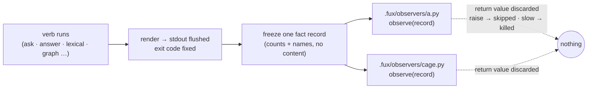

# SR-OBSERVE — `.fux/observers/`, the observe-only hook

## §1 — For humans

A consumer who wants to know *how* fux is being used — how often, with which
verb, how confidently — has one honest place to learn it: **after** a verb has
finished and printed. This record gives that place a name. `.fux/observers/` is
a directory the consumer owns, seeded empty by `fux setup`, and every `*.py`
(and, on the Node reader, `*.mjs`) in it is called once per invocation with a
single frozen record of **counts and names only** — the verb, a hash of its
normalised arguments, the confidence band, the result and `related` counts,
the refer verdicts, the wall-clock, the fux version. Never the question, never
a document, never the answer.

**Observe-only is structural, not a promise.** The dispatcher runs after
stdout is flushed, passes a copy, and has no return path. An observer that
raises is skipped for that run; one that runs past `[observe] max_ms` is killed
the same way. Byte-for-byte the verb's output is identical with zero, one or a
misbehaving observer installed, and a test says so. That is why this is a
seam and not middleware: a pre-verb hook would make `ask` a function of the
consumer's code, and L3 would be gone.

**fux ships no observer and imports none by name.** The first subscriber is
cage, whose `setup` writes
`.fux/observers/cage.py`; a test asserts `src/fux` names nothing cage-shaped.
That is also why `.fux/observers/` is the third readable-source exemption in
[SR-LAW-10](0011_LAW-10-bundled-output.md) decision 2 (Arpit, 2026-09-14): the
consumer, or a tool the consumer installed, writes and owns that code.

**Diagram — Mermaid and its ASCII twin. Update both, always, together.**



<details>
<summary><b>ASCII twin</b> — the same diagram, for terminals, diffs, and any reader without a Mermaid renderer</summary>

```text
  verb runs ──> render, stdout flushed, ──> freeze ONE fact record
  (ask, answer,  exit code fixed              (counts + names, no content)
   lexical, ...)                                      │
                                         ┌────────────┴────────────┐
                                         v                         v
                              .fux/observers/a.py       .fux/observers/cage.py
                                  observe(record)           observe(record)
                                         │                         │
                              return discarded            return discarded
                              raise -> skipped, named under FUX_DEBUG
                              slow  -> killed at [observe] max_ms
                                         └──────────> nothing flows back
```

</details>

---

## §2 — For agents

### Context

Cage's search leg ([`work/open/W-170`](../work/open/W-170-cage-search-leg.md))
asked how often an agent reaches for fux instead of `grep`, and — the half
only fux can answer — how often fux answered *weakly* and the agent went to
`grep` within the next three steps. The transcript half cage reads on its own.
The fux half was first designed as an emitter fux ships, which would have put a
cage-shaped code path inside fux. Arpit ruled it the other way round on
2026-09-14: *"a middleware that fux exposes and cage can intercept"*, narrowed
in the same conversation to **observe-only**. This record is that ruling as a
component.

### Decision

1. **The directory.** `.fux/observers/` holds `*.py` for the Python reader and
   `*.mjs` for the Node reader, readable source by contract, seeded empty by
   `fux setup`. [SR-FUX-DIRECTORY](0102_fux-directory.md) lists it; SR-LAW-10
   decision 2 exempts it. Node's half ships with the Python half or
   [SR-NODE-SEARCH](0153_node-search.md) declares it out of scope in the same
   change — never silently missing.
2. **The event.** After a verb has fully rendered — stdout flushed, exit code
   fixed — fux calls each observer's `observe(record)` **once**, in sorted
   filename order, with a frozen copy of one record.
3. **The record, closed schema.** `verb · args_hash · band · answerable ·
   n_results · n_related · refer_verdicts{} · ms · expand_used · q_arms ·
   fux_version`. Every value is a count, a name from a fixed vocabulary, a
   boolean, or a hash. **Forbidden, by test:** the question, any expansion
   text, a document id, a path, a snippet, the answer. A field is added to the
   schema by amending this decision, never by an observer asking.
4. **`args_hash`** is SHA-256 over fux's normalised argv (flags sorted, values
   as given, the question **excluded**), truncated to 16 hex. It is the contract
   shared with cage's transcript classifier and is fixture-tested on quoted and
   escaped command lines on both sides; the fixture is the first line of work.
5. **Observe-only, structurally.** No return path, a copy not a reference, and
   the dispatch point is after every write the verb makes. A test asserts
   `ask`/`answer`/`lexical`/`graph` output is byte-identical with zero, one, and
   a raising observer installed. Nothing here may run before a verb — refused
   by design, not deferred.
6. **Fail-open, bounded.** A raising observer is skipped for that run with one
   `FUX_DEBUG` line naming the file and the exception class; a slow one is
   killed at `[observe] max_ms` (declared in `fux.toml`, default small, owned by
   [SR-CONFIG](0113_config.md)) and reported the same way. The verb's exit code
   is never touched.
7. **Liveness.** `fux doctor` lists each observer file and whether it ran on
   the last invocation; a present-but-never-firing observer is a row
   ([SR-DOCTOR](0152_doctor.md)).
8. **No knowledge of any subscriber.** `src/fux/` imports nothing from and
   names nothing after cage or any other subscriber; a test greps for it.
   A `fux-observer` guide skill is **not** written until a second subscriber
   exists ([SR-AGENT-POLICY](0132_agent-policy.md)).
9. **Laws.** L2: the record carries no content, so nothing durable leaves the
   source system. L3: nothing flows back, so determinism is untouched. L4:
   counts are not a use record of any document. L8: a record handed to the
   consumer's own code is not a network call and reaches no commit. L1: the
   dispatcher is stdlib.

### Consequences

- A consumer gains a place to measure fux without fux measuring anything for
  them; every observer is theirs to read, edit and delete.
- One more directory `fux setup` seeds and `fux doctor` watches.
- The `args_hash` contract is now shared with a second repository; a change
  to normalisation is a breaking change for every subscriber and must be
  versioned in the record (`fux_version` is in the record for that reason).
- ⚠ **The cap is a wall-clock, and L3 says nothing about time.** A slow
  observer changes *when* fux returns, never *what*; that is stated so nobody
  files it as a determinism defect.

### Alternatives considered

- **An emitter fux ships** (`ledger/fux/` written by fux itself) — rejected by
  Arpit 2026-09-14: fux would carry a cage-shaped path and learn a consumer's
  name. The superseded emit design is kept as history in
  `archive/proposals/cage-search-leg.md` (archived 2026-09-14); the decision is
  cage's `work/compare/fux-search-leg.compare.md` (option C).
- **A pre-verb middleware** (filter, rewrite, veto) — rejected: `ask` becomes a
  function of consumer code and L3 is gone. The word *middleware* in the ruling
  was narrowed to *observe-only* in the same conversation.
- **A real-time agent hook** (Claude Code `PreToolUse`) — cage's own rule
  refuses hook-based capture; fux has no say in it.
- **An environment variable pointing at one script** — rejected: one
  subscriber only, and no `doctor` row can see it.

### Reference (required)

- [`work/open/W-170`](../work/open/W-170-cage-search-leg.md) — the item; its
  Definition of done is this record's build list
- [SR-LAW-10](0011_LAW-10-bundled-output.md) decision 2 — the exemption
- [SR-DECODE](0139_decode.md) · [SR-FETCHER](0117_fetcher.md) — the two sibling
  exemptions this one is shaped after
- [SR-CLI](0101_cli-surface.md) — the dispatch point, once built
- cage's half: `cage/searchtx.py` `args_hash`, and
  `cage/tests/fixtures/search/args_hash.json` — the ten frozen vectors

### Veto condition

**Reopen if** any observer's return value or side effect is ever read by fux;
if a field carrying content (text, id, path) enters the record; if an observer
failure changes a verb's exit code; or if `src/fux/` gains an import or a
string naming a subscriber.

**How to check it:** `pytest tests/test_observe.py` (owed by W-170) — the
byte-identity test with a raising observer installed, the schema grep, and the
no-subscriber-name grep; until it exists, this record is `proposed` and the
directory does not exist.
