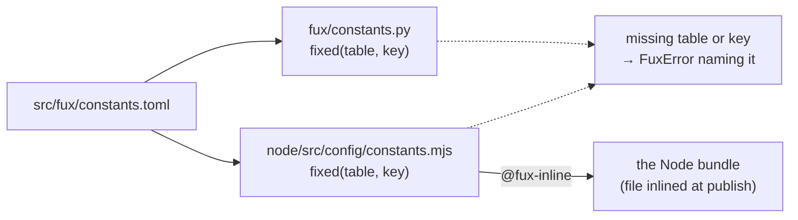

<!-- COMPONENTS-START — GENERATED from records/README.md's OWNERSHIP and DESCRIBES tables by scripts/gen-components.py. Do not edit by hand: change the table, then run `python scripts/gen-components.py --write`. -->

**Owns** — the components this record decides:

- [`node/src/config/constants.mjs`](../node/src/config/constants.mjs) · file
- [`src/fux/constants.py`](../src/fux/constants.py) · file
- [`src/fux/constants.toml`](../src/fux/constants.toml) · file

<!-- COMPONENTS-END -->

# SR-CONSTANTS — the engine's fixed values live in one TOML file both planes read

## §1 — For humans

**Law [L12](0014_LAW-12-values-live-in-config.md) gives every value one home.**
A *tunable* value — one a person could choose differently — lives in the
consumer's own TOML. A *fixed* value is different: changing it changes what a
committed byte means. `fux.index.v5`, the name `graph.json`, a decoder's
`VERSION`, the eight bytes of a PNG chunk header. Nobody should edit those per
repository, and both runtimes must agree on every one.

**This record decides where the fixed ones live: `src/fux/constants.toml`.** It
ships inside the wheel, and the Node bundle carries it inlined as a string. The
engine code keeps readable names — `SCHEMA_ID`, `GRAPH_NAME` — but each one is
*read* from this file, never written as a literal.



<details>
<summary><b>ASCII twin</b> — the same diagram, for terminals, diffs, and any reader without a Mermaid renderer</summary>

```text
                     src/fux/constants.toml
                       |                  |
                       v                  v
        fux/constants.py         node/src/config/constants.mjs
        fixed(table, key)        fixed(table, key)
                       :                  |
                       :                  | @fux-inline (the bundler)
                       :                  v
                       :          the Node bundle -- the file's text inlined
                       v
        missing table or key -> FuxError naming the file, table and key
```

</details>

---

## §2 — For agents

### Context

Before W-225 every fixed value was a module literal, and the ones shared by the
two runtimes were spelled twice — `SCHEMA_ID` in `store/format.py` and in
`store/format.mjs` — held equal by tests that grepped the Node source for the
literal. Law L12 (decisions 2 and 4) requires one home read by both planes, and
decision 6a (R7) widens *fixed* to the numbers a file format, a protocol or the
algorithm defines.

### Decision

1. **One file, `src/fux/constants.toml`, holds every fixed engine value.** It is
   organised in tables by subject — `[index]`, `[graph]`, `[files]`,
   `[runtime]`, `[decoders.<name>]`, `[receipt]`, `[fuse]`, `[versions]`,
   `[templates]`, `[schema_files]`, … — and each key carries the comment that
   explains it. `[schema_files] package` names the one package every declared
   shape ships in, `fux.schemas` ([SR-LAWS](0001_LAWS.md) decision 6, W-226).
   Three
   of its values are algorithm bounds a record already ruled NOT tunable, which
   is what makes them fixed rather than a `tune.toml` key: `fux path`'s work
   budget (`[graph] path_expansion_budget`), the community sweep cap that runs
   in `fux build` (`[graph] community_max_sweeps`), and RRF's published `k`
   (`[fuse] rrf_k`). The explanation of *why a value is what it is*
   stays beside the code that uses it.

2. **Two loaders, one sentence.** [`src/fux/constants.py`](../src/fux/constants.py)
   and [`node/src/config/constants.mjs`](../node/src/config/constants.mjs)
   expose `fixed(table, key)` and `table(name)`. A missing table or key raises
   `FuxError` reading `src/fux/constants.toml: [<table>] <key> is missing` in
   both runtimes — the repository path, because the bundle has no path of its
   own.

3. **A module binds a name at import.** `SCHEMA_ID = fixed("index", "schema")`
   is the pattern: the name keeps its spelling for every caller, and a hot loop
   reads a module attribute, not a dictionary.

4. **The wheel ships the file beside the loader** (hatch packages
   `src/fux/**`). **The Node bundle carries it inlined:** the loader reads it
   with `/* @fux-inline src/fux/constants.toml */ readFileSync(...)`, and
   [`store/nodebundle.py`](../src/fux/store/nodebundle.py) replaces that
   expression with the file's text as a string literal
   ([L10](0012_LAW-10-bundled-output.md)). A named file that does not exist
   fails the bundle.

5. **Built-in decoders import the loader absolutely** — `from fux.constants
   import fixed` — because `fux setup` copies them into a consumer's
   `.fux/decoders/`, where a relative import has no package to resolve against
   ([SR-DECODE](0139_decode.md) decision 11).

6. **Python's `constants.py` imports only the standard library and `.errors`.**
   `hatch_build.py` loads the bundler inside an isolated build, and the bundler
   reads its artefact names through this module.

7. **A consumer never sees this file and cannot change it.** A value a consumer
   may choose is not fixed, and belongs in their `fux.toml` or a `.fux/*.toml`
   ([L12](0014_LAW-12-values-live-in-config.md) decision 1).

<!-- L12-NOTE-START -->

**W-225 stage 3a (2026-09-27)** added `[templates] output` — the output
template's file name — and `[answer] candidates`, the number of documents
`fux answer` hands the refer plane. The count stays fixed because every extra
candidate is a real fetch against someone's source system.

**W-225 stage 3b (2026-09-27)** added `[index] shards` — `256`, because
`shard = blake2b(id, digest_size=1)`. `fux.toml [index] shards` is a check that
refuses any other number, never a setting ([SR-CONFIG](0113_config.md)
decisions 3 and 17; SR-LAW-12 decision 9a).

<!-- L12-NOTE-END -->

<!-- L12-VALUES-START -->
<!-- L12-VALUES-END -->

**W-225 stage 4a (2026-09-27)** added `[templates] formats_limits` — the file name of the decoder-caps template appended to a seeded `formats.toml`.

**W-225 stage 4c (2026-09-28)** added `[templates] inspect` and `[files] inspect` — the template's name and `.fux/inspect.toml`'s path.

**W-228 (2026-09-28)** bumped `[inspect] facts_schema` to `fux.inspect.facts.v2`: pass A now records each document's front-matter key names (`meta_keys`), so every cached facts entry is recomputed once ([SR-INSPECT](0156_inspect.md) decision 24).

**W-225 stage 5a (2026-09-28)** added the numbers an algorithm fixes ([L12](0014_LAW-12-values-live-in-config.md) decision 6a, R7): `[stem]`, `[json] indent`, `[pii.luhn]`, `[pii.verhoeff]`, `[blake2b]`, `[ranking] score_digits`, `[pyfloat]`, `[frontmatter] indent` and `[confidence] signal_digits`. Where a refactor removed a literal outright (a suffix's own length, a named regex group, tuple unpacking), no key was added. ⚠ `node/src/config/toml.mjs` is the reader of this file and cannot depend on it; it holds no numeral either.

**W-225 stage 5b (2026-09-28)** added the decoders' format numbers: `[decoders.image.format]`, `[decoders.pdf.format]`, `[decoders.rtf.format]`, `[radix]`, `[markdown]` and `[ooxml]`. A byte string is stored as latin-1 text, and a record layout as a Python `struct` format.

**W-225 stage 5c (2026-09-28)** added the wire, store and protocol numbers: `[index] shard_header_lines` and `max_record_depth`, `[bundle] shim_mode` and the banner widths, `[markdown] min_table_lines`, `[decoders] digest_hex`, `[maintain] question_key_hex` and `lock_mode`, `[bm25f]`, `[observe]`, `[refer]`, `[mcp]`'s JSON-RPC codes and `score_digits`, `[exit]` and `[win32]`.

**W-225 stage 5e (2026-09-28)** added `[fetch]` (`undeclared_max_parallel`, the rate-limit retries and backoff, `kib`), `[maintain] max_passes` and `[doctor] as_ingested_veto_share` — three values the L12 classification had proposed as consumer keys, fixed instead because an earlier ruling or record already decides them ([SR-CONFIG](0113_config.md) decision 18).

**W-225 stage 5f (2026-09-28)** added `[bundle] shim_sniff_chars` — how much of a launcher `fux doctor` reads to tell a fux shim from another tool's.

**`[intent]` and `[intent.type]` joined the file on 2026-09-28** (W-168 step 9;
[SR-RANKING](0111_ranking.md) decision 13). The cue lexicon is a FIXED value and
not a tunable: a pre-registration froze it, and
`tests/query/test_intent_prior.py` holds it equal to that bar's tag, pattern for
pattern. A consumer who wants other cues is I2, which is not built.

### Consequences

- **Parity between the runtimes holds by construction** for every shared fixed
  value. The parity tests that grepped Node source for a literal now evaluate
  the Node export instead (`tests/test_node_config_parity.py::_node_export`).
- **A fixed value changes in one line**, and the change lands in both runtimes
  and the next bundle together.
- **The file grows with R7.** Byte offsets and protocol codes are named keys
  rather than inline numbers; the binary decoders read more names and fewer
  digits.

### Alternatives considered

- **Keep fixed values as code constants.** Rejected by Arpit, 2026-09-27
  (SR-LAW-12 §Alternatives): Node and Python must not each carry one.
- **A JSON file.** Rejected: every other config file fux reads is TOML, both
  runtimes already carry a TOML reader, and JSON carries no comments — the
  comment on a key is half of why it is safe to leave alone.
- **Generate a `.mjs` from the TOML at build time.** Rejected: a second
  generated artefact in the checkout, and a Node test run against `node/src/`
  would need the generator to have run first. Inlining at bundle time needs
  neither.

### Reference (required)

- [SR-LAW-12](0014_LAW-12-values-live-in-config.md) decisions 2, 4, 6a — the law this implements.
- [W-225](../work/open/W-225-values-live-in-config.md) — the migration.
- [L12 classify](../work/compare/l12-classify.compare.md) — which values are fixed, and R7–R10.
- [SR-LAW-10](0012_LAW-10-bundled-output.md) — why the bundle carries the file inlined.

### Veto condition

**Reopen if** a fixed engine value is found as a literal in `src/fux/**` or
`node/src/**` outside `setup.py` and `templates/`, or if the two loaders print
different sentences for the same missing key.

**How to check it:**

```bash
.venv/bin/python -m pytest -q tests/test_l12_values_live_in_config.py
# expect: passed — the AST test fails on any literal not in its reviewed allow-list
```

---

## References

**Records** — [SR-LAW-10](0012_LAW-10-bundled-output.md) ·
[SR-LAW-12](0014_LAW-12-values-live-in-config.md) · [SR-DECODE](0139_decode.md)

**Work** — [W-225](../work/open/W-225-values-live-in-config.md) ·
[L12 classify](../work/compare/l12-classify.compare.md)
