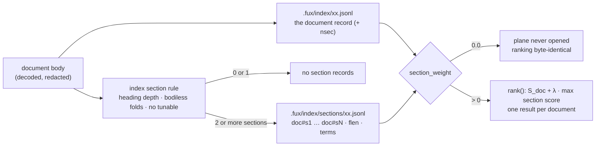

<!-- COMPONENTS-START — GENERATED from records/README.md's OWNERSHIP and DESCRIBES tables by scripts/gen-components.py. Do not edit by hand: change the table, then run `python scripts/gen-components.py --write`. -->

**Describes** — reaches into, does not own:

- [`src/fux/refer/_chunk.py::_sections,_title_index`](../src/fux/refer/_chunk.py) · owned by [SR-CHUNKING](0151_chunking.md)

<!-- COMPONENTS-END -->

# SR-SECTIONS — section records

## §1 — For humans

A long document whose answer sits under one heading loses at ranking. Its
query words are a small share of a big document. U0 (a query-time re-rank)
could only reorder documents that were already in the top k, so it could not
bring back one that never made it in. **Arpit ruled U2** (2026-09-29): every
section becomes its own record in the committed index, so a section is scored
with its own length.

**What this record fixes.** Section records live in **their own plane**,
`.fux/index/sections/`, beside the document shards and sharded like them. A
section is cut by **heading depth alone, with no tunable**. A document keeps
**one result**: its score gains `section_weight` × its best section's score
(B2). At the default `0.0` nothing reads the plane, so the ranking is
byte-identical to an index without it.

**What it costs.** On the golden ladder the plane **roughly doubles the
committed index** (+98.4 % at rung-10000, 50.4 MB in total). That passes both
commit limits, but it is a real cost
([the run](../work/regression/2026-09-30-section-size/report.md)). **Nothing is
built.** The build waits for a scored set whose `step10_section` pool is at
least 6.



<details>
<summary><b>ASCII twin</b> — the same diagram, for terminals, diffs, and any reader without a Mermaid renderer</summary>

```text
  document body (decoded, redacted)
      |
      +--> the document record ---------------> .fux/index/xx.jsonl  (+ nsec)
      |                                                  |
      +--> index section rule                            |
           (heading depth, bodiless folds, no tunable)   |
              |                                          |
              +-- 0 or 1 section  -> no section records  |
              +-- 2 or more       -> .fux/index/sections/xx.jsonl
                                     doc#s1 ... doc#sN : flen, terms
                                                         |
                               section_weight ----------+
                                 0.0  -> plane never opened, byte-identical
                                 > 0  -> rank(): S_doc + λ * best section
                                         one result per document
```

</details>

---

## §2 — For agents

### Context

- **The ruling** ([compare doc](../work/compare/section-units.compare.md)):
  **U2 · B2 · E1**. U2 means section records in the index. B2 means
  `score + λ · best_section` with `λ = [ranking] section_weight`, default
  `0.0`. E1 means `hit@1` on the `step10_section` pool, with `section@1`
  reported beside it. The ruling left the format, the section id and the fold
  back to one result per document to a record written before the build. This is
  that record.
- **U1 stays refused**: no section index built from content fetched at query
  time ([SR-POSTINGS](0112_postings.md), and the compare doc's own reason).
  Everything here is written by `fux ingest` from the bytes ingest already
  reads, so the committed plane stays enough to answer a query.
- **What already cuts sections.** [SR-CHUNKING](0151_chunking.md) derives
  passages from heading depth in `refer/_chunk.py`, at answer time, over
  fetched bytes. Its fold test reads `[refer] min_passage_bytes`, a tunable.

### Decision

**1. Section records live in their own committed plane,
`.fux/index/sections/xx.jsonl`.** Each file starts with the same header line as
a document shard, and each record is one canonical line.

- **Why a separate plane rather than extra lines in the document shards.**
  About twenty-five modules iterate the document shards: the scan, the
  accelerator build, graph, inspect, doctor, correct, enrich, mcp, serve, the
  Node reader, and others. Each of them counts every line into `n`, `df` and
  the length totals. Section lines in those files would mean twenty-five
  places that must skip them, and one missed skip moves `idf` for every query.
  A separate directory is outside `iter_shard_paths`'s `??.jsonl` glob, so every
  existing reader is untouched by construction.
- It is committed, doc-major and diffable for the same reasons as the document
  plane ([SR-INDEX-LIFECYCLE](0108_index-lifecycle.md) decisions 1–4).

**2. The index section rule — heading depth, and nothing that can be tuned.**
Over the same text `extract.py` tokenises (the decoded, PII-redacted body):

1. cut at every heading with `_chunk._sections`: the same grammar
   (`decode/_markdown.py`), a preamble counted as a section, and
   whitespace-only sections dropped;
2. a section that is **only its heading line** folds forward into the next
   section **when that one is strictly deeper**, carrying its heading line
   with it. The document title (`_chunk._title_index`) is always such a
   section, so it needs no rule of its own;
3. **one section or none** → the document is *sectionless* and gets no
   section records;
4. otherwise the sections are numbered `1…N` in document order.

- **How this maps onto SR-CHUNKING.** It uses the same grammar and the same
  `_sections`, with a different fold test: *bodiless* where the chunker uses
  *shorter than `min_passage_bytes`*. A bodiless section is a single heading
  line, which is nearly always under the floor, so a chunker section is one
  index section or a consecutive run of them. ⚠ The one exception is a heading
  line longer than `min_passage_bytes`: the index folds it and the chunker
  does not. The chunker's table-row bands and its
  paragraph → line → word ladder are passage rules and never make a section,
  so a 20 000-row `.csv` is one section, not 20 000.
- **Why the fold test is different.** A committed byte may not be a function
  of a tunable ([SR-TUNE](0135_tuning.md) decision 6). Folding on
  `min_passage_bytes` would make editing `tune.toml` rewrite the index.
- It lives beside `_fold` in `refer/_chunk.py`, so the two fold rules sit
  together and cannot drift. `.rst`, `.adoc` and `.org` headings are not
  Markdown and get no section records, which is what the chunker already does
  with them.

**3. A section record is `{"id", "flen", "terms"}` and nothing else.**

- `id` is `<document id>#s<k>`, for example `file:docs/ops.md#s3`. The parent
  is `id.rsplit("#", 1)[0]`, which is unambiguous even for a `url:` id that
  contains `#`, because the suffix is always appended last.
- `flen` and `terms` use the **first two slots of `TF_FIELDS` only** (`body`,
  `heading`), trimmed like every other tf list
  ([SR-POSTINGS](0112_postings.md)). A section's heading field holds its own
  heading line and any bodiless headings folded into it. `title`, `path` and
  `ctx` are properties of the document, and the document score already counts
  them.
- **No heading text, no `sha`, no `loc`.** The id is an ordinal, so the plane
  commits hashed statistics only, and L3's exposure is exactly what it is
  today.
- 🔴 **Totality is the invariant.** Summed over a document's section records,
  the body and heading token counts equal what `extract.py` counts for the
  whole document's body and heading (front-matter values excluded). **Measured:
  0 misses on every rung**
  ([run](../work/regression/2026-09-30-section-size/report.md)).
- **The document record gains `nsec`**, the number of its section records.
  It is omitted when the document is sectionless (`omit_when`, as
  `archived` is). A reader can then tell *sectionless* from *sections
  missing*, and the build can check the two planes agree (decision 9).

**4. Sharding follows the parent.** A section record goes to
`sections/<shard_for(parent id)>.jsonl`: the same shard number as its document.
Lines are sorted by id, the file is written only if its bytes changed, and an
empty shard file is removed ([SR-INDEX-LIFECYCLE](0108_index-lifecycle.md)
decisions 1 and 4). Editing one document touches one document shard and at most
one section shard, both with the same number.

**5. `best_section` comes from the index, never from `refer`.** For a candidate
document `d`, with `λ = [ranking] section_weight`:

```
S(d) = ( S_doc(d) + λ · max_k S_sec(d#s_k) ) · w(d)
```

- `S_sec` is the **same `score_record`** in `rank()`, over the section's body
  and heading slots, with the **document** `df` and `n` and a **section**
  `avg_wlen`. That average is `derive_wlen` over the section plane's `flen`
  totals plus the body and heading `flen` of every sectionless document,
  divided by the number of units counted.
- **A sectionless document is its own single section.** Its section view is
  its own record restricted to the body and heading slots. It is scored the
  same way, so short documents are not penalised for having no section records.
- **Ties go to the lowest `k`.** Anchor terms stay document-level: a section
  gets no anchor field. The `--expand` guard is unchanged, because it runs on
  the document before anything is scored.
- **This is one scorer, not a second stage.**
  [SR-RANKING](0111_ranking.md) decision 6 reserves BM25F arithmetic to
  `rank()`, and this term lives there, as the anchor fold does (decision 12b).
  Decision 2's *weight then saturate once* governs fields **within** a unit.
  B2 adds the scores of two units (the document and one of its sections), which
  is Arpit's ruling, not a second per-field BM25.
- **`refer` is not consulted.** `section@1` (E1's side metric) stays `refer`'s
  first passage. The index's best section is reported beside it, and neither
  feeds the other: one mechanism per arm.

**6. One result per document, always.** A section is never a hit, a candidate
or a line in the output. When `λ ≠ 0`, each hit carries
`section: "<document id>#s<k>"`, or `null` for a sectionless document, and
`--why` names the section term's contribution. **When `λ = 0` the key is
absent**, because the output has to be byte-identical (decision 7).

**7. `0.0` is OFF, not "weight zero"** (the anchor field's rule,
SR-RANKING decision 12c). At `0.0` neither reader opens `.fux/index/sections/`,
no section statistic is computed, and no arithmetic runs. **A v6 index at
`0.0` must rank byte-identically to the pre-section engine on the same
corpus**, and that is Part B's first gate. When `λ > 0`:

- **The scan** reads the section plane in the same pass as the document
  shards: every line's `flen` for the average, and the lines whose raw bytes
  match a query hash, grouped by parent.
- **The accelerator** derives a per-document section table at `fux build`, from
  the committed section plane, and pins those shard shas in the runtime
  manifest. It never reads committed shards at query time. Its skip ceiling
  adds `λ · idf(h) · (k1 + 1) · weight(h)` per deferred term before
  `× weighting.maximum`. That bound is sound because a BM25 term contribution
  is below `idf · (k1 + 1)` for any tf, and an unseen document's sections can
  only match the deferred terms.
- **The Node reader transcribes both** ([SR-NODE-SEARCH](0153_node-search.md)
  and the differential law).

**8. `_format` bumps by [SR-INDEX-LIFECYCLE](0108_index-lifecycle.md)
decision 9.1, and `fux ingest --full` is the migration.**

- A plane and a property appear, and an older index could not say *no
  multi-section documents* versus *predates section records*. That is the
  W-48 trap. So `_format` moves to the next version (`fux.index.v8` if nothing
  else bumps first; v6 and v7 were spent by W-168 step 8 and its removal). `analyzer` and `tf_fields` are untouched.
- The migration is decision 10a's `--full` through the foreign-index seam.
  Section records are `carried` with their document when the document's sha is
  unchanged, and `extract.RULES_VERSION` bumps with the rule.
- **`url:` records need their bytes again** to be split. `--full` already
  refuses a foreign index that holds `url:` records and points at `fux ingest`,
  which refetches. A URL whose fetch fails keeps its document record with no
  `nsec`, so it is sectionless, which is a correct, degraded state.
- ⚠ **Every consumer re-ingests, so the bump ships only with a PASS**
  ([the handoff](../work/open/W-236-section-records.md)).

**9. The two planes are held together.**

- `fux build` refuses an index where a document's `nsec` differs from the
  number of section lines under its id, or where a section line has no parent.
  That is the same *refuse rather than diverge* rule as decision 6 there.
- The merge driver ([SR-MERGE-DRIVER](0130_merge-driver.md)) resolves a
  section shard **by its parent's verdict**: a document's sections come from
  the side whose document record won on `(ver, sha)`. A section line has no
  `ver` or `sha` of its own to compare.

**10. The size, measured on the ladder** (fixed before the build, as the
ruling required): at rung-10000, 9 663 of 10 000 documents split into
**39 417 section records** (4.08 each, max 25). They add **+24 971 205 B to a
25 380 579 B document plane (+98.4 %; +79.6 % after zlib)**, and the largest
file is 168 451 B. Both frozen commit limits pass
([verdict](../work/regression/2026-09-30-section-size/VERDICT.md)). No record
grades the ratio. SR-WORK-SCALE judges by reasoning, and SR-INDEX-LIFECYCLE
says size is measured, never gated. So the ratio is a cost Arpit has seen, not
a pass.

**No decision here moved** (W-254, 2026-10-04): the refer chunker gained the frontmatter unit ([SR-CHUNKING](0151_chunking.md) decision 7); section decisions are untouched.

### Consequences

- **Part B owes, in one change with its PASS:** `[ranking] section_weight` in
  [SR-TUNE](0135_tuning.md) and the template; the `nsec` field and its example
  in `schemas/index-record.schema.json` ([SR-RECORD](0109_index-record.md)); the
  `section` hit key in `output.schema.json` ([SR-API](0154_api.md)); the plane
  in [SR-DOTFUX](0102_fux-directory.md)'s committed list and in
  `.gitattributes`; the merge driver's parent rule; both readers; the build
  invariant; and this record's `owns`.
- **The index about doubles on prose.** Formats that emit one sibling heading
  per record (`.jsonl`, `.pdf`, `.pptx`) get one section per record, page or
  slide. That is not measured, because the ladder has none of those formats.
  Rows of a table never become sections.
- **A section cannot be cited offline by its heading.** The id is an ordinal.
  `refer` recovers the heading by running the same rule on the fetched bytes,
  and the fetched sha is what makes that honest.
- **Headroom is unproven.** `b = 0.15` already takes most of the length
  penalty away, and the pool is 1 on set-4-claude. The compare doc's *low
  confidence* stands.

### Alternatives considered

- **Section lines inside the document shards.** Rejected for decision 1's
  reason: every existing reader would need a skip, and one missed skip changes
  `n` and `df` everywhere.
- **U3, per-section tf inside the document record.** This was the compare
  doc's fallback. It is not a size escape: it saves about 2 MB of the 25 MB
  added at rung-10000 (the ids and headers), and it gives up the separate plane
  that makes `0.0` byte-identical by construction
  ([analysis](../work/regression/2026-09-30-section-size/ANALYSIS.md) §3).
- **Fold on `min_passage_bytes`, exactly as the chunker does.** Rejected under
  SR-TUNE decision 6: a tunable would reach committed bytes.
- **Slug ids (`#rollback-procedure`).** Rejected because heading text would go
  into the one field every reader treats as identity. Duplicate headings need a
  counter anyway, and the slug algorithm would have to be transcribed
  byte-for-byte into Node.
- **Section-level `df` and `n`.** Rejected: that is a second corpus statistic
  both paths must agree on, per query, under the differential law. It would
  also put two `idf` scales into one score.
- **Committing each section's heading as a display field.** Rejected for now
  because it adds content beyond `phrases`' cap, and bytes, for an offline
  label `refer` can recover. Adding it later is a property change and another
  bump.
- **Section records for single-section documents too.** Rejected because they
  would duplicate the document's own postings for nothing. Decision 5's section
  view scores the document record itself.

### Reference (required)

- The ruling: [`work/compare/section-units.compare.md`](../work/compare/section-units.compare.md).
- The size: [`work/regression/2026-09-30-section-size/`](../work/regression/2026-09-30-section-size/report.md),
  from [`tools/section-size/measure.py`](../tools/section-size/measure.py).
- The code this design reuses: [`src/fux/refer/_chunk.py`](../src/fux/refer/_chunk.py)
  (`_sections`, `_title_index`), [`src/fux/ingest/extract.py`](../src/fux/ingest/extract.py),
  [`src/fux/query/rank.py`](../src/fux/query/rank.py),
  [`src/fux/query/scan.py`](../src/fux/query/scan.py),
  [`src/fux/derive/accel.py`](../src/fux/derive/accel.py),
  [`src/fux/store/format.py`](../src/fux/store/format.py).

### Veto condition

**Reopen this decision if:**

- the size tool, re-run on the ladder, shows any committed file above 50 MiB or
  a total above 1 GB at rung-10000;
- it reports any totality miss;
- or, once built, a v6 index at `section_weight = 0.0` ranks any query
  differently from the pre-section engine on the same corpus.

**How to check it:**
`.venv/bin/python tools/section-size/measure.py --ladder ~/my_programs/fux-lab/corpora/golden --rungs rung-10000 --out /tmp/s.json`.
Then read `largest_file_bytes`, `projected_total_bytes` and `totality_misses`.
On 2026-09-30 they were 168 451, 50 351 784 and 0: not fired.

---

## References

*Every source this record cites, gathered in one place. §2's **Reference
(required)** names the grounding; this is the complete list. An archived
document is never listed here — the body may name one, but archive is not
evidence.*

**Records** — [SR-CHUNKING](0151_chunking.md) · [SR-INDEX-LIFECYCLE](0108_index-lifecycle.md) ·
[SR-RANKING](0111_ranking.md) · [SR-POSTINGS](0112_postings.md) ·
[SR-TUNE](0135_tuning.md) · [SR-RECORD](0109_index-record.md) ·
[SR-API](0154_api.md) · [SR-DOTFUX](0102_fux-directory.md) ·
[SR-MERGE-DRIVER](0130_merge-driver.md) · [SR-NODE-SEARCH](0153_node-search.md)

**Code**

- [`src/fux/refer/_chunk.py`](../src/fux/refer/_chunk.py)
- [`src/fux/ingest/extract.py`](../src/fux/ingest/extract.py)
- [`src/fux/query/rank.py`](../src/fux/query/rank.py)
- [`src/fux/query/scan.py`](../src/fux/query/scan.py)
- [`src/fux/derive/accel.py`](../src/fux/derive/accel.py)
- [`src/fux/store/format.py`](../src/fux/store/format.py)
- [`tools/section-size/measure.py`](../tools/section-size/measure.py)

**Measured evidence**

- [`work/regression/2026-09-30-section-size/report.md`](../work/regression/2026-09-30-section-size/report.md)
- [`work/regression/2026-09-30-section-size/VERDICT.md`](../work/regression/2026-09-30-section-size/VERDICT.md)
- [`work/regression/2026-09-30-section-size/ANALYSIS.md`](../work/regression/2026-09-30-section-size/ANALYSIS.md)

**Project docs**

- [`work/compare/section-units.compare.md`](../work/compare/section-units.compare.md)
- [`work/open/W-236-section-records.md`](../work/open/W-236-section-records.md)
