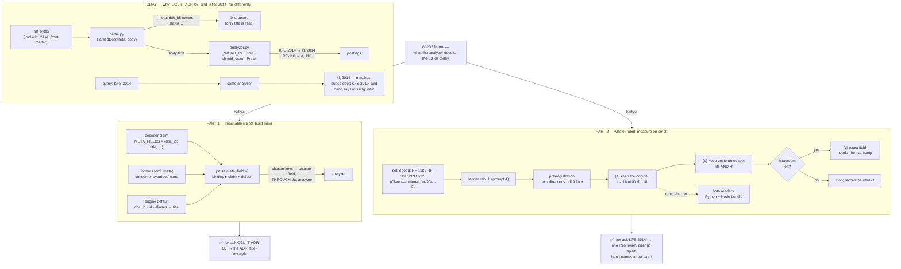

# W-205 — identifiers: reachable, then whole

**Model: Opus** — part 1 adds a claim/binding mechanism to the decoder contract
and part 2 edits the one module ingest and query both import; a one-step
divergence between the two sides is a silent no-match with no error to see.

**Merged 2026-09-20 (Arpit):** *"W-201 and W-203 are the same thing … don't have
multiple work items for the same kind of thing."* Absorbs
[W-201](../../archive/open/W-201-frontmatter-scalars-not-indexed.md),
[W-203](../../archive/open/W-203-identifier-analyzer-defects.md) and **W-168
step 2** (the exact identifier field). [W-202](../../archive/open/W-202-identifier-analyzer-gate.md)
stays its own row: it is the *before* fixture (⚠ the two links above move to `archive/open/` with the files), green, and both parts here diff
against it.

---

## ✅ RULED 2026-09-20 (Arpit, Cowork) — both parts unblocked

- **Part 1 — *"201: fix it."*** The proposal below is **accepted as written**:
  option **A** (decoder `META_FIELDS` claim + `formats.toml [meta]` binding + engine
  default), identity keys `doc_id` / `id` / `aliases` → **`title`**, `tags` →
  `ctx`, **no person-name key by default**. 🟢 buildable now — its pre-registration
  needs only the three frontmatter-only seed ids and phase A's rows, both filed.
- **Part 2 — *"203: do it based on set 3."*** The failing-shape identifiers come
  from **set 3, Claude-authored** (W-204 input I-2, ruled the same day) — not from
  Codex's prompt 7. Part 2's pre-registration is written the day the ladder is
  rebuilt with set 3's documents; the (a)+(b)-then-(c) order stands.
- **Ball → 🟢 `agent`.** Build order: W-202 fixture → part 1 → (set 3 lands) →
  part 2. **The inbox row is gone.**

## The flow, end to end



**Read it top to bottom:** the top box is the defect pair as it exists today —
one id never enters the index, the other enters in pieces. Part 1 adds a claim /
binding / default layer so a decoder says which of its keys are identity, and
those values go into the `title` field **through the same analyzer** — which is
why part 2 still matters after part 1. Part 2 changes what the analyzer emits,
cheapest family first, measured against set 3, and only reaches (c) if (a)+(b)
leave headroom.

## Why they looked like one thing, and why they are two defects

Same symptom — *"I typed the id and fux did not find the document"* — two
different places in the pipeline, one after the other:

```
file bytes ──► parse.py ──► ParsedDoc(meta, body) ──► analyzer ──► postings
                  │                                       │
                  │ DEFECT 1 (was W-201)                  │ DEFECT 2 (was W-203)
                  │ `meta` is dropped: a doc_id that      │ `body` text IS indexed, but
                  │ lives only in frontmatter never       │ `RF-118` becomes `rf`,`118`
                  │ reaches the analyzer at all.          │ and `KFS-2014` becomes `kf`,`2014`.
                  │ → the id is ABSENT from the index.    │ → the id is PRESENT, in pieces.
```

| | defect 1 — *reachable* | defect 2 — *whole* |
|---|---|---|
| where | `src/fux/ingest/parse.py` — the meta/body split | `src/fux/query/analyzer.py` — `_WORD_RE` and `should_stem` |
| what happens to `QCL-IT-ADR-08` in frontmatter | never indexed; **absent from top 50 at every rung** | n/a — never gets this far |
| what happens to `KFS-2014` in the body | indexed | indexed as `kf` + `2014`: one rare term became two common ones |
| effect | **recall**: 3 of 33 seed ids cannot be found at all | **precision**: `RF-118/119/120` collide on `rf`; `confidence.missing: dairi` names a word nobody typed |
| measured | [headroom run](../regression/2026-09-18-identifier-headroom/report.md): the 3 absolute misses | same run: 30/33 top-3 already — mangling is symmetric, so recall survives |
| fix size | small ingest change + a rule for which keys | two lines in the analyzer + a Node transcription + a `_format` decision |
| blocker | **Arpit's ruling on part 1 below** | **a seed with the failing shape** — ruled today, arrives with prompt 7 |

**Order:** part 1 first. It is independent, cheap, and its fix (an id reaching
the index) is what part 2 then has to keep whole.

---

## Part 1 — reachable: which frontmatter values enter the index (RULED 2026-09-20 — accepted as proposed)

**Arpit, 2026-09-20:** *"The decoder should have some kind of pattern in how
individual properties are going to be ingested. Or is there a generic way that
can be implemented? Propose."*

### The generic way — the pattern fux already has, applied a third time

Decoders claim extensions (`EXTENSIONS`), fetchers will claim hosts (`ROUTES`,
W-199). Both are a **module claim + a committed binding + a resolver**. The same
three layers give every decoder a say in which of its metadata keys are
searchable, without inventing a mechanism:

| layer | today | proposed |
|---|---|---|
| **claim** — in the decoder module | `EXTENSIONS = (".md",)` | `META_FIELDS = {"doc_id": "title", "aliases": "title", "tags": "ctx"}` — key → target field |
| **binding** — committed, consumer-owned | `.fux/formats.toml [decoders]` | `.fux/formats.toml [meta]` — same shape, overrides the claim, may map a key to `none` |
| **default** — engine | — | `{"doc_id": "title", "id": "title", "aliases": "title"}`, applied to every decoder that emits `meta` |
| **resolver** | `decode._bind` | `parse.meta_fields(decoder)` — binding wins over claim wins over default; the result is a closed dict |

**A key not in the resolved dict is not indexed.** That is the closed list you
asked for, but per decoder rather than one global list — a YAML front-matter
decoder and an `.eml` header decoder name different keys (`doc_id` vs
`Message-ID`), and each says so in its own file.

### What the four ways cost

| option | what it is | recommend? |
|---|---|---|
| **A · claim + binding (above)** | generic; a consumer decoder for a new format declares its own identity keys; audited in `formats.toml` | **yes** — third instance of an existing pattern, no new concept |
| B · one global list in `formats.toml` | `[meta] index = ["doc_id","aliases"]` for every decoder | simpler; wrong for `.eml`/`.yaml` whose id keys differ; a consumer must edit config to make their own decoder's keys searchable |
| C · decoder emits the field itself | `ParsedDoc.body` gets the id prepended by each decoder | invisible: no config, no doctor row, and every decoder re-implements the rule differently |
| D · index every scalar | everything in `meta` becomes searchable | `statuss: rushed-review` is in the seed today; names enter posting lists without SR-PII's gate |

### Field and weight — recommendation

- **Target `title` (weight 2.0) for identity keys** (`doc_id`, `id`, `aliases`).
  An identifier is how a person *names* the document; typing it should rank like
  typing the title. `ctx` (1.0) makes it one body word among ten thousand.
- **Never a person field by default** (`owner`, `author`, `contributors`) — a
  consumer may bind one explicitly, and SR-PII runs on the value first.
- **No new field.** A sixth field is a wire-format change; the two that exist
  are enough for the two strengths that matter.

### ✅ Ruled

1. Option **A**.
2. Default set: `doc_id`, `id`, `aliases` → `title`; `tags` → `ctx`.
3. Person-name keys excluded by default; a consumer may bind one explicitly.

### Definition of done, once ruled

- Pre-registration first: the three frontmatter-only seed ids are the headroom
  and **3 is below the floor**, so the endpoint is data-shaped — *the three become
  reachable* — plus a no-harm arm on the 33 id-queries and a sample of non-id
  questions from W-204's phase A rows.
- `META_FIELDS` claim read by the registry (same import path as `EXTENSIONS`);
  `[meta]` binding validated at load (unknown field name = named error);
  resolver in `parse.py`; the chosen values appended to the chosen field's
  token stream **through the analyzer**, so part 2 applies to them.
- `fux doctor` row: every bound key names a real field; a claim/binding
  collision on the same key is a finding, not an error (binding wins, said aloud).
- Tests: a listed key is retrievable, an unlisted one is not, a `none` binding
  silences a claim, `.eml` and `.md` decoders resolve different dicts.
- Records: SR-INGEST gains the decision; SR-DECODE the claim; SR-CONFIG the
  `formats.toml` table; W-202's fixture gains the three ids.

---

## Part 2 — whole: the analyzer keeps an identifier as one token (RULED — measured on set 3)

### The two lines

- **D1 — `_WORD_RE = [A-Za-z0-9_]+`.** `_` is in the class; `-` `.` `/` are
  not. So `ERR_2031` arrives as one token and the splitter emits **whole and
  parts**; `RF-118` arrives as two tokens and **no whole form ever exists**. The
  analyzer's own docstring promises whole-and-parts; it keeps the promise for
  `snake_case` only.
- **D2 — `should_stem`.** Protects digits and underscores, not all-letter
  fragments. `kfs` → Porter → `kf`; `dairy` → `dairi`; `ops` → `op`. The one
  signal that it holds an id fragment — case — was discarded one step earlier.

### Why it is not a recall bug

`analyze()` is imported by ingest **and** query. `DAIRY-2` typed as a query
produces the same `['dairi','2']` the document wrote, so it matches. Measured:
**30/33 top-3 at every rung.** What is lost is precision (siblings share `rf`),
`idf` (one rare term → several common ones), and honesty (`missing: dairi`).

### The families, cheapest first — and the order that matters

| | mechanism (shipped prior art) | what it changes here |
|---|---|---|
| **(a)** preserve original beside parts — Lucene `WordDelimiterGraphFilter` | extend the `camelCase` rule to `-` `.` `/`: emit `rf-118` **and** `rf`, `118` |
| **(b)** stemmed and unstemmed both — Lucene `KeywordRepeatFilter` | one branch in `analyze()`: emit `kfs` and `kf`, let `idf` decide; removes D2's judgement call |
| **(c)** a separate exact field — Elasticsearch `body.exact` | **this was W-168 step 2.** The only family that can *weight* exact above stemmed; needs committed postings and a `_format` decision |
| (d) trigram plane — zoekt, Blackbird | out of scope for 3.0; recorded so it is not re-invented |

🔴 **(a) is a precondition of (c).** A separate field is still fed by the
tokenizer; a tokenizer that cannot see past a hyphen feeds it fragments.

### Why it is held, and what lifted it today

The headroom is **3–4 of 33 on every rung** against SR-RS decision 19's floor of
**6 net flips**: no arm on this corpus can return a verdict, whatever is built.
**Arpit ruled 2026-09-20, twice:** first that the failing shape — `RF-118 /
RF-119 / RF-120`, `PROJ-123 / PROJ-124` — joins the seed with the link-bearing
documents so the ladder is rebuilt once; then, later the same day, that **Claude
authors it as set 3** rather than waiting on Codex's prompt 7. That is input **I-2** of
[W-204](W-204-golden-outputs-scoring-and-version-benchmark.md); part 2's
pre-registration is written the day the rebuilt ladder is verified.

⚠ **D2 as a correctness fix is NOT ruled.** The diagnostic lie (`missing:
dairi`) does not depend on ranking headroom; taking D2 alone, now, on that
argument is a call Arpit has not been asked to make. Named here so silence is
not read as a decision.

### Definition of done, when the seed lands

1. Family chosen — **(a)+(b) first, (c) only if headroom remains** — in a frozen
   pre-registration before a line changes; both directions, d19 floor.
2. **W-202 green before**; its diff is evidence after, and the item names every
   row that moves.
3. **Both readers.** The Node bundle transcribes the analyzer; a Python-only fix
   ships `--fast`/scan drift. A differential arm is mandatory.
4. Token-count cost measured and reported (splitting cost ×1.03 on this repo).
5. `_format` / analyzer-version handling decided in the pre-registration.
6. Records: SR-INGEST, SR-RANKING, SR-INDEX-LIFECYCLE at minimum.

---

## Out of scope

- W-168 steps 3–10 (other ranking ideas) — they stay in W-168.
- Family (d).
- Anything in part 1 that indexes a person's name by default.

## Records this item will touch

SR-INGEST · SR-DECODE · SR-CONFIG (part 1) · SR-RANKING · SR-INDEX-LIFECYCLE ·
SR-RS (part 2) · SR-PII cited, not amended.
