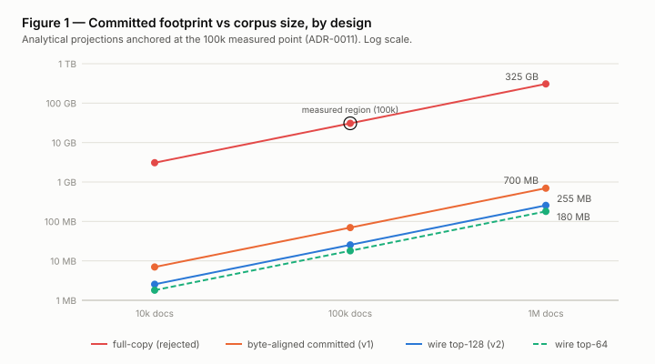
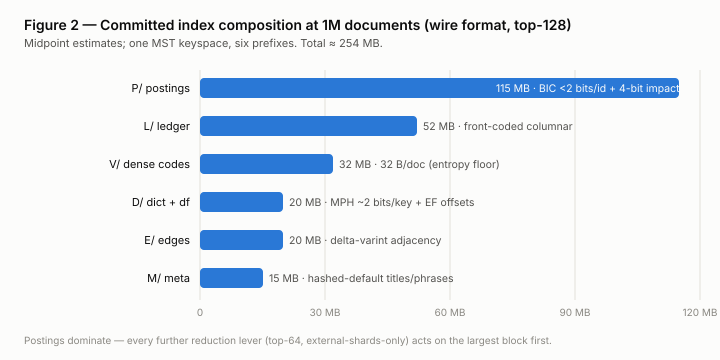
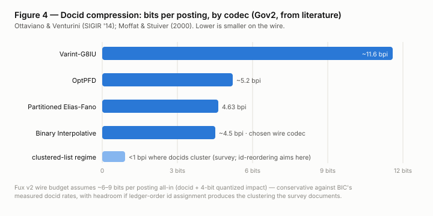
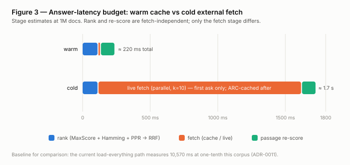

# The Fux Index: Index-and-Refer Retrieval over Git-Carried Knowledge

**Arpit Arya** · drafted with Claude (Anthropic)
*Draft v0.2 — 2026-08-09 · supersedes the withdrawn FuxDB draft (v0.1)*

## Abstract

Agents working in codebases need ranked, cited answers from organizational
knowledge — documentation, decisions, runbooks — that lives partly in the
repository and partly in external systems (Confluence, SharePoint, web).
Existing options either copy that content into a search store (staleness,
duplication, ACL drift) or traverse it live (no ranking, no verification).

We present the **Fux Index**: an *index-and-refer* architecture in which the
only durable artifact is a small, deterministic index — pruned per-document
term statistics, dense binary codes, an extracted link graph, and a source
ledger — carried **in git** as one content-addressed keyspace, while every
byte of content remains in the system that owns it. Answers are produced by
ranking entirely from the index, fetching only the cited documents from
their sources (through a version-keyed cache), and re-scoring passages on
the fetched text, so freshness is verified per answer rather than maintained
per corpus.

We give an analytical model, grounded in published compression and pruning
results and in measurements of the current Fux engine at 10⁵ documents,
projecting a committed footprint of **≈ 220–290 MB at 10⁶ documents**
(Figures 1–2), warm-path answers around **220 ms** (Figure 3), and merge
behavior in which concurrent ingest cannot conflict. All load-bearing
claims are stated as falsifiable predictions with a defined evaluation
plan (§8); the pruned-ranking quality prediction P1 gates the build.

## 1. Introduction

### 1.1 Problem

The consumer is a software agent inside a coding session. Before modifying
an artifact it must find the *reasons* behind it — the ADR that governs a
module, the runbook a deploy follows, the decision that superseded last
quarter's design. Three properties follow:

- **Ranked retrieval with citations.** "Which document best answers this?"
  is a scoring question; graph traversal alone cannot answer it, and an
  uncited answer is unusable by an agent that acts on it.
- **Content has owners.** Repo docs belong to git; Confluence pages belong
  to Confluence, with their own ACLs and edit history. Copying them into a
  store creates a second truth that drifts — the disease this tool exists
  to cure, reproduced in its own storage layer.
- **The deployment envelope is hostile.** Per-repository, offline-capable,
  zero runtime dependencies, deterministic to the byte, auditable by
  procurement. These are the Fux engine's standing laws [19].

### 1.2 The design in one paragraph

Ingest visits each source, converts it *transiently*, and extracts only a
finding-structure: the top-k most document-distinguishing terms (KL-ranked
[1]), a 32-byte binary embedding code, typed link edges, and a ledger entry
(locator, content sha, policies). The converted text is then discarded. The
extracted structure — six key prefixes in one Merkle-Search-Tree keyspace
[4] — is committed to git in a bit-packed wire format (§5) and inflated
locally into memory-mapped query segments. A question is answered by ranking
purely in the index, fetching the top-k documents from their owning systems
(cache-first [11]), re-scoring passages on the fetched bytes, and citing the
fresh sha — the stale-while-revalidate [12] / read-repair [13] pattern with
cost bounded by citation count, not corpus size.

### 1.3 Contributions

1. An architecture at the intersection of federated search [2], static index
   pruning [1], and version-controlled storage [3, 4] that no prior system
   occupies (§3).
2. A **single-keyspace committed index** whose merge is one CRDT join and
   whose state is named by one root hash (§4).
3. A wire/runtime format split that brings the committed footprint to
   ~250 B/doc using published codec results [5, 6, 7] (§5, Figures 1, 2, 4).
4. An analytical latency model anchored in measured baselines (§6, Figure 3).
5. A falsifiable evaluation plan in which the architecture's riskiest
   assumption — pruned ranking quality — gates all construction (§8).

## 2. Related work

**Federated / distributed IR.** Brokers rank from collection summaries and
fetch from autonomous engines; resource selection (CORI, ReDDE) and result
merging are the classical hard problems [2]. Fux occupies the *cooperative*
corner with a single scorer: summaries are maintained (not sampled) because
Fux owns ingest, and score merging vanishes because sources are byte stores,
not engines.

**Static index pruning.** Carmel et al. establish that most of an inverted
index can be dropped with bounded early-precision loss [8]; Büttcher &
Clarke's *document-centric* variant keeps each document's top terms by KL
contribution [1] — precisely the "keywords per document" this design
commits. Quality at k=128/64 on Fux's own corpora is prediction P1.

**Index compression.** Partitioned Elias-Fano reaches 4.63 bits/docid on
Gov2 [5]; Binary Interpolative Coding is smaller still and reaches < 1
bit/int on clustered lists [6, 7]; minimal perfect hashing stores static
term sets at ~2 bits/key [9, 10]. These published rates parameterize §5.

**Versioned storage and merge.** ForkBase [3] demonstrates versioning,
dedup, and tamper evidence pushed into the substrate; Merkle Search Trees
[4] give ordered content-addressed trees with *unique representation* and
state-based-CRDT merge, production-proven in the AT Protocol. Dolt's
cell-level three-way merge shows structural merging still surfaces semantic
conflicts [14]; §7 eliminates the dominant conflict classes by construction
instead.

**Freshness.** RFC 5861's stale-while-revalidate [12], Dynamo-lineage read
repair [13], and DBSP's incremental-view-maintenance equivalence theorem
[15] jointly license serving from a stale index and verifying only what a
read touches, with delta maintenance provably equal to recompute.

**Adjacent tools.** Graphify [16] builds deterministic AST knowledge graphs
of code for agents — structure, not ranked retrieval; no external
connectors; docs pass through an LLM. Fux is the knowledge-side complement,
joined at file-path/symbol edges.

## 3. Architecture

Sources own content. The committed index owns *findability*. The local
plane owns *speed*. The answer path owns *truth*.

```
sources (git dirs · confluence · sharepoint · web)   ← content stays here
   │  ingest = extract, then discard (two modes, §3.2)
   ▼
THE INDEX — one MST keyspace, committed to git (§4, §5)
   │  inflate on clone (hooks)
   ▼
local: mmap query segments · ARC cache · eval harness
   │
answer: rank in index → fetch cited k docs → passage re-score → cite fresh sha
```

### 3.1 Per-source policies

Each ledger entry carries two policy fields, set in `fux.toml`:

- `mode = refer | snapshot` — refer (default) keeps no content; snapshot
  additionally commits a machine-made copy, for air-gap availability,
  PR-reviewed change tracking, or audit retention.
- `meta = hashed | plain` — hashed (default for external sources) stores
  only term/phrase *hashes*, closing the ACL-mismatch leak in which
  repo-cloners without source access could read index-derived summaries.
  Plain is opt-in where repo ACL ⊇ source ACL.

### 3.2 Ingest modes

- **Inferred mode** (default): $0, offline, stdlib, deterministic — KL term
  selection, YAKE-class phrases [17], static-table embedding codes, edge
  extraction. Byte-reproducible; the mode all guarantees are stated for.
- **AI-assisted mode** (opt-in): model-derived enrichment — semantic term
  expansion, model-inferred edges (graded below deterministic signal),
  summaries. Two rules preserve the laws: outputs are **pinned** into the
  index with provenance and re-read forever (never re-generated on any
  query path), and they carry a distinct grade wherever they compete with
  deterministic signal. *(Naming note: the repo's edge-grade vocabulary
  (EXTRACTED = deterministic) collides with calling this tier "extracted";
  resolution is an open decision.)*

## 4. One keyspace

All six components are key ranges in a single content-addressed MST [4]:

| prefix | content | wire encoding |
|--------|---------|---------------|
| `L/` | ledger: locator, sha@index, policies, version | front-coded columnar |
| `P/` | postings: docs per kept term, quantized impacts | BIC + 4-bit impacts |
| `D/` | term dictionary + exact df | MPH + EF offsets + varint df |
| `V/` | dense codes | raw 32 B/doc |
| `E/` | typed edges | delta-varint adjacency |
| `M/` | doc meta: titles, phrases (hashed by default) | front-coded / hashes |

Consequences: **one root hash names the entire corpus state** (audit, drift
detection, and "same index?" checks are a hash compare); **one merge
algorithm** covers everything (§7); **one diff** is O(changes) [4]; one
format version. The theoretically maximal unification — a wavelet-tree
self-index serving postings and forward index from a single succinct
structure [18] — was evaluated and rejected for interpreted-decode cost;
it is recorded as a research note, not a build item.

## 5. Size model

Assumptions: 10⁶ documents × ~10³ lines (~10⁴ words, ~65 KB) each; top-128
kept terms/doc; ~8M-term pruned vocabulary (Heaps); ~10⁷ extracted edges.

| prefix | arithmetic | estimate |
|--------|-----------|----------|
| `P/` | 128M postings × (BIC docids ~4.5 bpi [5,6] + 4-bit impacts), conservatively 6–9 bits all-in | **90–140 MB** |
| `L/` | ~120 B/doc raw → front-coded columnar, 128-bit shas | 45–60 MB |
| `V/` | 32 B × 10⁶ (entropy floor of 1-bit codes) | 32 MB |
| `D/` | MPH ~2 bits/key [9,10] + EF offsets + df | 15–25 MB |
| `E/` | 10⁷ × ~2 B delta-varint | ~20 MB |
| `M/` | hashed-default | ~15 MB |
| **total** | | **≈ 220–290 MB** (top-64: ≈ 160–200 MB) |

Figure 1 places these against the alternatives across corpus sizes; Figure 2
shows the composition; Figure 4 shows the codec rates the postings row
assumes, against published measurements.







Two stacking levers are not in the table: **partial clone** [20] defers
index blobs to first touch, and — sharpest — **repo-source shards need not
be committed at all**, being re-derivable from the clone by hooks; a
corpus that is mostly internal commits only its external-source shards.

The wire format is decode-once: hooks inflate it into byte-aligned,
memory-mapped runtime segments (~2.5 GB, gitignored) whose block decode
runs at native speed from Python via `memoryview.cast`/`array` — the
committed artifact never pays a query-speed tax, and the runtime format
never pays a clone tax.

## 6. Latency model

Anchored baselines (measured, 100k synthetic, ADR-DOTFUX [19]): full-index
load-everything query 10 570 ms; lean warm 4 105 ms; binary-code scan
54.5 ms of which ~93% is a removable conversion overhead; ingest
5.7 ms/doc.

Projections at 10⁶ docs (Figure 3): rank ≈ 80–150 ms (MaxScore over pruned
postings with block-max skipping [7]; 2–4-term queries touch a small
fraction of 128M postings); dense scan 35–50 ms on int-cached codes
(measured basis); fetch ≈ ms cache-hit / 0.5–2 s live-parallel; passage
re-score 50–150 ms on k ≈ 10 documents. **Warm ≈ 220 ms; cold ≈ 1.7 s,
first ask only.**



## 7. Merge

Three tiers, by what automation is safe:

1. **Same source, both branches** → determinism yields identical index
   entries → three-way merge sees "same change"; *cannot conflict*.
2. **Divergent source versions** → per-entry last-writer-wins register on a
   deterministic clock (version ordinal, sha tie-break); the MST join
   resolves identically on all machines [4]; the loser survives in git
   history.
3. **Human-authored files** (snapshot-mode Markdown) → ordinary git
   conflicts, *on purpose* — auto-resolving two humans' edits to a rule
   document is silent knowledge loss.

Derived planes never merge: post-merge hooks re-derive them from the joined
ledger, licensed by IVM equivalence [15].

## 8. Evaluation plan — falsifiable predictions

The build is gated: P1 runs before any other component is constructed, on
the existing 100k synthetic + acme/orbit eval corpora and goldens.

| # | prediction | threshold | falsifies |
|---|-----------|-----------|-----------|
| P1 | KL top-128 pruning preserves ranking quality | hit@5 within 2–3 pts of full index | the entire premise |
| P2 | committed wire ≤ 300 MB at 10⁶ docs | measured on synthetic corpus | §5 model |
| P3 | warm answer ≤ 300 ms at 10⁶ | end-to-end bench | §6 model |
| P4 | cold external answer ≤ 3 s (k=10, parallel) | bench w/ mock server | fetch design |
| P5 | clone→first-answer ≤ 5 min (inflate + rederive) | fresh-clone bench | wire/runtime split |
| P6 | concurrent-ingest merge produces zero conflicts | branch-merge harness | §7 tier 1–2 |
| P7 | 20-doc commit re-indexes < 1 s via hooks | hook bench | maintenance path |

Two risks are named, not modeled: interpreted-Python constant factors on
adversarial queries (mitigation: signature prefilter [19]; measurement
gates claims), and rare-term recall loss inherent to pruning [1, 8]
(mitigation: Bloom signatures + honest decline; measured in P1's recall
slice).

## 9. Limitations

Content in dead external sources is unrecoverable by design in refer mode —
the ledger proves *that* and *what-hash* was known, never *what was said*;
snapshot mode exists for exactly the documents where that is unacceptable.
Live verification puts the network on an opt-in query path — a deliberate,
fenced exception to the offline law, defaulting off. Cold-fetch latency is
real and demo-visible; cache warming at install is the planned mitigation.
The hashed-meta default trades `explain`-surface readability for leak
safety on external sources. All numbers in §5–§6 are projections until the
P-series lands; the paper's claim is that each is *cheap to falsify*.

## References

[1] Büttcher, S., Clarke, C. *A Document-Centric Approach to Static Index
Pruning in Text Retrieval Systems.* CIKM 2006.

[2] Callan, J. *Distributed Information Retrieval.* In Advances in
Information Retrieval, 2000. CORI; ReDDE: Si & Callan, SIGIR 2003.

[3] Wang, S. et al. *ForkBase: An Efficient Storage Engine for Blockchain
and Forkable Applications.* VLDB 11(10), 2018.
https://arxiv.org/pdf/1802.04949

[4] Auvolat, A., Taïani, F. *Merkle Search Trees: Efficient State-Based
CRDTs in Open Networks.* SRDS 2019.
https://inria.hal.science/view/index/docid/2303490

[5] Ottaviano, G., Venturini, R. *Partitioned Elias-Fano Indexes.* SIGIR
2014. http://groups.di.unipi.it/~ottavian/files/elias_fano_sigir14.pdf

[6] Moffat, A., Stuiver, L. *Binary Interpolative Coding for Effective
Index Compression.* Information Retrieval 3(1), 2000.
https://link.springer.com/article/10.1023/A:1013002601898

[7] Pibiri, G. E., Venturini, R. *Techniques for Inverted Index
Compression.* ACM Computing Surveys, 2020.
https://pages.di.unipi.it/pibiri/papers/ii_survey.pdf · Block-max: Ding,
S., Suel, T., SIGIR 2011; Mallia, A., Porciani, E., ECIR 2019.

[8] Carmel, D. et al. *Static Index Pruning for Information Retrieval
Systems.* SIGIR 2001.

[9] Esposito, E., Graf, T. M., Vigna, S. *RecSplit: Minimal Perfect Hashing
via Recursive Splitting.* ALENEX 2020. https://arxiv.org/abs/1910.06416

[10] Groot Koerkamp, R. *PtrHash: Minimal Perfect Hashing at RAM
Throughput.* SEA 2025.

[11] Megiddo, N., Modha, D. *ARC: A Self-Tuning, Low Overhead Replacement
Cache.* FAST 2003.
https://www.usenix.org/conference/fast-03/arc-self-tuning-low-overhead-replacement-cache

[12] Nottingham, M. *RFC 5861: HTTP Cache-Control Extensions for Stale
Content.* IETF 2010. https://datatracker.ietf.org/doc/html/rfc5861

[13] DeCandia, G. et al. *Dynamo: Amazon's Highly Available Key-value
Store.* SOSP 2007.

[14] DoltHub. *Cell-level Three-way Merge in Dolt.* 2020.
https://www.dolthub.com/blog/2020-07-15-three-way-merge/

[15] Budiu, M. et al. *DBSP: Automatic Incremental View Maintenance for
Rich Query Languages.* VLDB 16, 2023.
https://www.vldb.org/pvldb/vol16/p1601-budiu.pdf

[16] Graphify. *Code knowledge graphs for AI coding assistants.*
https://github.com/Graphify-Labs/graphify

[17] Campos, R. et al. *YAKE! Keyword Extraction from Single Documents
Using Multiple Local Features.* Information Sciences, 2020.

[18] Navarro, G. *Wavelet Trees for All.* CPM 2012.
https://users.dcc.uchile.cl/~gnavarro/ps/cpm12.pdf · Ferragina, P.,
Manzini, G. *Opportunistic Data Structures with Applications (FM-index).*
FOCS 2000.

[19] Fux engine internals: ADR-0008 (exact df sidecar), ADR-0009 (retrieval
kernel, edge grades), ADR-DOTFUX (100k measurements), BitFunnel basis:
Goodwin, B. et al., SIGIR 2017.

[20] Git project. *Partial Clone.* https://git-scm.com/docs/partial-clone
