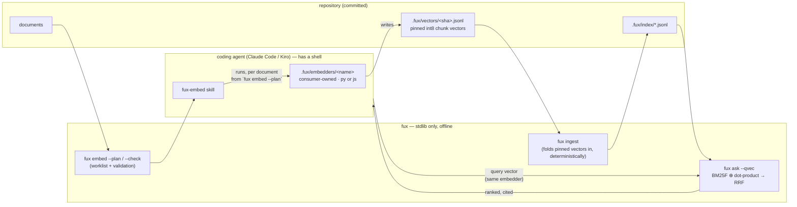

# Embeddings generated by the coding agent

**Filed 2026-09-04 · Cowork (Opus).** Elaboration of
[`retrieval-quality-per-verb.md`](retrieval-quality-per-verb.md) §2.1.
**Nothing here is authorised to be built** — §6 names the measurement that
has to run first, and it is an afternoon.

## 0 · The one-screen answer

- **The model cannot emit a vector; the agent can run a program that does.**
  Claude Code and Kiro execute shell commands. A skill tells the agent to run
  a consumer-owned embedder over the documents fux names, and to write the
  result into a **pinned, committed** plane — the exact shape `fux enrich`
  already has for model-written text.
- **Fux never embeds anything.** Not at ingest (L3), not at query (L1/L4).
  It reads pinned vectors the way it reads pinned enrichment, and it does
  integer dot products in the stdlib.
- **The query vector comes from the caller.** The same agent, the same
  embedder, one more call — passed to fux as an argument. Fux fuses the
  lexical and vector rankings in **rank space** (RRF), never by adding scores.
- **The bar is already frozen**: DENSE-CHUNK's `>= 3 fixed / 0 broken` on the
  50 goldens. The FAIL on record was a *static mean-pooled* model. A
  *contextual* one has never been measured here, and `q015` is the litmus.
  **Measure before building.**

## 1 · The flow



<details><summary>ASCII twin</summary>

```
  documents ──► fux embed --plan ──► [skill] ──► .fux/embedders/<name> (consumer code)
                                                        │ writes
                                                        ▼
                                         .fux/vectors/<sha>.jsonl  (committed, pinned)
                                                        │
                                                        ▼
                                                  fux ingest  (deterministic fold)
                                                        │
                                                        ▼
  agent ──(query vector, same embedder)──► fux ask --qvec ──► BM25F ⊕ dot ──► RRF ──► agent
```

</details>

**Read it as three moments, each with one owner.**

| moment | who runs what | network | model |
|---|---|---|---|
| **plan** | `fux embed --plan` — which documents in a scope declared `embed=true` have no vectors or stale ones (sha-keyed, like enrich) | none | none |
| **embed** | the agent, following the skill, runs `.fux/embedders/<name>` per document; writes `.fux/vectors/<sha>.jsonl` | whatever the *embedder* needs — fux is not in the process | in consumer code, outside fux |
| **ingest** | `fux ingest` validates and folds the pinned vectors into the runtime plane; committed bytes are a pure function of committed inputs | none | none |
| **query** | agent embeds the question with the same embedder → `fux ask "…" --qvec q.json` (or the MCP input) → fux ranks | none in fux | in the caller |

## 2 · The pieces, concretely

**`.fux/embedders/<name>.py` or `.js` — consumer-owned, written once by
`fux setup --embedder <name>`, never rewritten.** Same contract as fetchers:
fux does not import it, does not run it, and does not know what is inside.
Two templates ship:

- `local-py`: `sentence-transformers` over a small contextual model
  (`bge-small-en-v1.5` / `e5-small-v2` / `nomic-embed-text-v1.5`).
- `local-js`: `@huggingface/transformers` (ONNX under Node) — **no Python at
  all**, which is the same host the Node search port targets.

The contract is one line: *stdin: chunk text (one JSON object per line) →
stdout: `{"chunk": n, "v": [int8 …]}` per line*, plus `--identify` printing
`{"model": "...", "dim": 384, "version": "..."}`. Quantisation to `int8` is
the embedder's job, so fux never touches a float it did not read from a file.

**`.fux/vectors/<sha>.jsonl` — pinned and committed.**

```
{"_format":"fux.vectors.v1","source":"docs/adr/0012_ranking.md","source_sha":"3f8a…","model":"bge-small-en-v1.5","dim":384,"chunker":"fux.chunk.v1","chunks":9}
{"chunk":0,"v":[12,-7,…]}
…
```

- Keyed by the document's content sha, like enrichment: edit the document
  and its vectors are orphaned, not wrong. Partial coverage is the steady
  state and is declared per source line (`embed=true`).
- `fux embed --check` validates: frontmatter keys, `source_sha` matches,
  `chunks` equals what `refer/_chunk.py` produces for that sha (so the
  vectors line up with the passages `answer` cites), `dim` uniform across the
  scope, every `v` in `[-128, 127]`. **A scope with two models is refused**
  — a mixed-model dot product is a number with no meaning.
- Size: 9 chunks × 384 × 1 byte ≈ 3.5 KB per document as JSON text
  (~14 KB uncompressed with the commas; git zlib brings it back). At 10 000
  documents that is tens of MB committed — **the 23 % index growth measured
  when the old lane's vectors were committed is the reference point**, and
  it is why this is opt-in per scope.

**`fux ingest`** folds vectors into the runtime plane only (`.fux/runtime/`,
derived). Nothing about a vector reaches `.fux/index/` — the committed index
stays statistics-only and byte-identical with or without the vector plane.
That keeps the differential law's two paths untouched.

**`fux ask --qvec <file>` / `fux_search {query, qvec}`.** Fux computes the
int8 dot product of the query vector against every pinned chunk vector in
the reachable scope, takes each document's **best chunk** (max-sim, never
mean — the deleted lane's one correct argument), and fuses:

```
score_rrf(d) = 1/(60 + rank_bm25(d)) + 1/(60 + rank_vec(d))
```

Rank-space, so the two scales never meet ([Cormack et al. 2009](https://dl.acm.org/doi/10.1145/1571941.1572114)).
Without `--qvec` nothing changes: same bytes as today.

## 3 · What each law says

| law | holds? | how |
|---|---|---|
| **L1** stdlib | **yes** | fux imports nothing; integer dot products; the embedder is consumer code like a fetcher |
| **L2** content never durable outside its source | **⚠ conditional** | a vector is a statistic, but **embedding inversion is a demonstrated risk** already recorded on hashed records (CHANGELOG 0.34.0, P5, traded not closed). Rule: `hashed` meta sources get **no vectors** unless the line says `embed=true` explicitly, and the record says so |
| **L3** deterministic ingest | **yes** | vectors are pinned files; same files → same runtime bytes; no model in `fux ingest` |
| **L4** offline | **yes for fux** | the embedder may download a model once — that is the consumer's process, declared in the skill, never fux's |
| **L5** hashed meta default | unchanged | see L2 |
| **L8** no use record committed | **yes** | `--qvec` is recorded in the *receipt* (gitignored path), with the embedder's `--identify` output, so `fux verify` can replay |

## 4 · The determinism boundary moves — say where to

Today *"clone it and run the query"* gives the same bytes on every machine.
With this plane:

- **Document vectors:** fixed. Pinned files, committed, identical everywhere.
- **Query vector:** computed per machine by the consumer's embedder. ONNX /
  `transformers.js` / PyTorch differ in low-order bits across ISAs and
  versions. So two developers can get **slightly different query vectors**
  for the same question.
- **Does that reorder results?** The rank-flip run measured BM25F's
  adjacent-gap floor at ~5e-5 on 495 documents: nothing below that reorders.
  `int8` quantisation of the query vector and rank-space RRF both widen that
  tolerance. **But it is unmeasured for vectors** and must be, on two
  architectures, before the plane is called deterministic in any sense.
- **The honest promise becomes:** *same clone + same embedder name and
  version → same bytes.* The receipt carries both, and `fux verify` reports
  `unverifiable` when the embedder differs — the same four-state honesty the
  refer plane already has.

## 5 · What the skill looks like (sketch)

`fux-embed` follows `fux-enrich`'s discipline exactly:

1. `fux embed --plan [TARGET]` — the agent runs it, never the human pastes it.
2. More than one document and no scope named → **ask first**, state the
   count and the model download size.
3. Per document: `fux embed --plan <doc>` again immediately before writing
   (the sha can move); pipe the chunks through the embedder; write
   `.fux/vectors/<sha>.jsonl`; `fux embed --check <doc>`.
4. Never add `embed=true` yourself; never mix models in a scope; stop at a
   clean boundary.
5. At query time (the `fux-usage` skill): if the scope has vectors and the
   embedder is present, embed the question and pass `--qvec`; if not, run
   without it — **an absent vector is a degraded-but-honest query, never an
   error.**

## 6 · The gate — run this before any of the above exists

DENSE-CHUNK's frozen bar: **`>= 3 fixed / 0 broken`** on the 50 playground
goldens, control = today's `ask`. One scratch script, no fux code:

- embed the 10 playground documents' chunks (fux's chunker, via
  `refer._chunk`) with a contextual model; embed the 50 queries;
- fuse with BM25F via RRF, exactly as §2;
- grade, file per-query rows, classify `informed` (the goldens are known).

**`q015` is the litmus.** *"what is the current decision for east-west
traffic"* — the superseded ADR-0007 wins lexically; the static lane made it
*worse*. A contextual encoder should tell *"current"* from *"no longer
current"*. If it does not, the plane is closed with evidence and the text
route (doc2query, §4 of the sibling proposal) is the whole answer. If it
does, this becomes a compare doc against doc2query, and the two are graded
head-to-head on the same rows.

Repeat on two architectures for the query vectors and report the discordant
count — that is §4's number.

## 7 · Costs that are real and not fux's

- A model download (30–130 MB) on every developer machine and CI runner
  that wants `--qvec`; behind an enterprise proxy; on a Windows fleet.
  `$0` stays true of fux and stops being true of the host.
- Committed size: tens of MB at 10 000 documents if every scope opts in.
- A second thing that can be stale: vectors orphan on edit exactly as
  enrichment does, and `fux doctor` gains a line for it.

## 8 · Graduation trigger

The §6 gate is run and filed under `work/regression/`. **PASS** → compare doc
(*pinned vectors + caller query vector* vs *doc2query text*), then
`ADR-VECTORS`. **FAIL** → this file moves to `archive/proposals/` with the
verdict linked, and the embeddings question is closed on evidence.

## References

- [DENSE-CHUNK verdict](../regression/2026-08-24-dense-lane-gate/VERDICT.md) — the frozen bar and why the static lane failed
- [rank-flip susceptibility](../regression/2026-08-25-rank-flip-susceptibility/ANALYSIS.md) — the adjacent-gap floor
- [ADR-ENRICH](../../docs/adr/0040_enrich.md) — the pinned-model-output pattern this copies
- [Reciprocal rank fusion](https://dl.acm.org/doi/10.1145/1571941.1572114) — Cormack, Clarke, Buettcher, SIGIR 2009
- [`@huggingface/transformers`](https://github.com/huggingface/transformers.js) — ONNX inference under Node, no Python
- [Claude docs — Embeddings](https://platform.claude.com/docs/en/build-with-claude/embeddings) — Anthropic offers no embedding model
