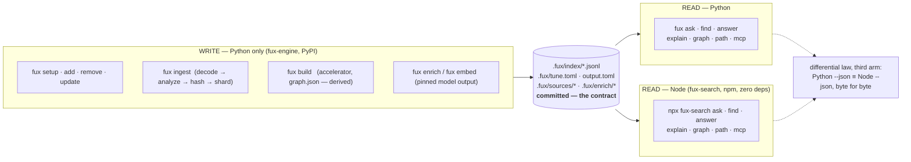

# A Node.js search-only port

**Filed 2026-09-04 · Cowork (Opus).** Arpit: *"I want ask, find, answer, graph
— the search CLI commands — exposed using Node.js as well so that it can work
with the tools where only Node.js is available and no Python. Just the search
functionality."*

## 0 · The one-screen answer

- **It is a port, not a wrapper.** With no Python on the host there is nothing
  to shell out to; the Node package must read the committed index itself.
  Everything it needs is committed as human-readable JSONL, so this is
  feasible — but four things will silently diverge unless they are ported
  *bit-for-bit* (§4).
- **Scope: read-only.** `ask`, `find`, `answer`, `explain`/`graph`/`path`,
  and **`mcp`** — the MCP server is the actual reason a Node-only host wants
  this, and it is the same four verbs behind JSON-RPC. **Not** `ingest`,
  `build`, `add`/`remove`/`update`, `enrich`, `doctor`, `setup`.
- **Zero dependencies, same as Python.** L1 applies to the port: Node ≥ 20
  stdlib only, one ESM file, `npx`-runnable.
- **The acceptance gate already exists.** The differential law
  (`tools/differential/`) asserts `--fast` and `--scan` are byte-identical;
  the port adds a third arm — **Node vs Python `--json`, byte-identical over
  every golden on both corpora** — pre-registered before the first line ships.
- **Estimated size: ~2 500 lines of JS**, Sonnet-executable once the gate and
  the four divergence points are written down; the divergence points
  themselves are Opus work.

## 1 · Architecture — one writer, two readers

**The purpose (Arpit, 2026-09-04):** a frontend project, or any Node
pipeline, should be able to *read* a fux index without installing Python.
Python remains the only thing that *writes* one. So the design is a
**write/read split over the committed index**, and the committed index is the
contract between the two.



<details><summary>ASCII twin</summary>

```
   WRITE (Python only)                 the contract                    READ (either)
   ──────────────────                  ────────────                    ─────────────
   fux setup/add/remove/update  ──┐                                 ┌─► python: fux ask/find/answer/graph/mcp
   fux ingest                    ──┼─►  .fux/index/*.jsonl          │
   fux build      (derived only) ──┤    .fux/tune.toml, output.toml ├─► node:   npx fux-search ask/find/answer/graph/mcp
   fux enrich / fux embed        ──┘    .fux/sources/*, .fux/enrich/*
                                        (committed)                   └──── differential law: py --json ≡ node --json
```

</details>

### 1.1 · The three flows this serves

**Local development.** One developer, one repo, both runtimes available.

```
edit docs ──► git hook / `fux update` (Python) ──► index committed
                                                        │
      Claude Code / Kiro (MCP over Node or Python) ◄────┘   ask · find · answer
```

Python writes; whichever reader the agent's host has, reads. Same bytes
either way — that is the third arm's promise.

**A frontend repo / Node pipeline with no Python.**

```
CI (Node image) ─► npx fux-search find "…"   ─► paths piped to a step
                ─► npx fux-search answer "…" ─► cited passage in a PR comment
                ─► npx fux-search mcp        ─► Kiro / VS Code agent tools
```

The index was committed by whoever last ran Python — a developer's machine,
or a separate maintenance job that has Python. **The Node reader never
needs the writer present**, and it refuses an index whose `_format` it does
not know rather than guessing.

**Index maintenance for a Python-less team.** Two options, both outside the
port: a scheduled job (or the fux daemon) on one machine that has Python and
pushes the refreshed index; or a container step in CI with `fux-engine`
installed that runs `fux update` and commits. The write side is not being
ported, and this proposal says so rather than implying a Node `ingest` is
coming.

### 1.2 · What the split does NOT change

- **Nothing new is committed for Node.** It reads the same files Python
  reads; there is no "Node format". A repo that never installs the npm
  package sees no difference.
- **Derived planes are per-runtime.** Python's `.fux/runtime/` is Python's.
  Node builds what it needs in memory (the graph plane) and, later, may
  keep its own gitignored cache under `.fux/runtime/node/` — declared in
  ADR-DOTFUX's table when that day comes, never before.
- **The laws apply to both readers.** L1 becomes *Node stdlib only*; L4
  is easier — Node never fetches at all.

## 2 · What "just the search functionality" has to read

| plane | file | committed? | Node reads it |
|---|---|---|---|
| index | `.fux/index/<shard>.jsonl` | yes | yes — the scan path (`query/scan.py`), no accelerator |
| tune | `.fux/tune.toml` | yes | yes — needs a TOML reader (§4.4) |
| output | `.fux/output.toml` | yes | yes — same reader |
| sources | `.fux/sources/dirs` (archived/enrich flags) | yes | yes, for the `archived` marker |
| enrichment | `.fux/enrich/` | yes | **no** — already folded into `ctx` at ingest |
| runtime | `.fux/runtime/` (accelerator, `graph.json`) | derived, built by **Python** `fux build` | **no** — cannot assume it exists; the graph plane is rebuilt in-process from committed edges (§3) |
| acquired | `.fux/acquired/` | gitignored, not rebuildable | optional — `answer` on a `url:` document reads the blob when present |
| fetchers | `.fux/fetchers/*.py` | yes | **no** — they are Python; see §3 `answer` |

## 3 · Per verb

- **`find`** — analyzer → hashes → scan shards → BM25F → `Weighting` →
  optional proximity rerank → sort `(-round(score, 9), id)` → locs. The
  smallest port and the first differential target.
- **`ask`** — `find` + display title (P5 cache is derived; fall back to the
  record's title/hash exactly as Python does with no cache) + W-84 matched
  headings + the confidence block + `--why`. Same output schema
  (`query/output.schema.json` is the contract; the port validates against
  the same file).
- **`answer`** — `file:` documents: read the working tree, chunk, rescore,
  assemble, cite fresh sha — all portable. `url:` documents: the consumer
  fetchers are Python and **do not exist in this host**, so `answer` uses the
  `.fux/acquired/` blob when the line kept one (verdict `as-ingested`, as
  ADR-ACQUIRED already defines) and falls back to `"source": "index"`
  otherwise. **Node never fetches.** That is not a gap to close; it is L4 on
  a host that has no fetcher.
- **`explain` / `graph` / `path`** — edges are committed on the records
  (`E/`), communities are derived. The Node port rebuilds the plane in
  memory: `edges_from_records` → determinized label propagation
  (`graph/community.py`, sorted visit order, smallest-label tie-break, fixed
  sweep cap) → PPR-lite walk / bounded routes. The 2026-08-22 acceptance
  result — `graph.json` hashes identically on two architectures — becomes the
  Node target too: **the in-memory plane must hash identically to what
  Python's `fux build` writes.**
- **`mcp`** — stdio JSON-RPC, the same three tools (`fux_search`,
  `fux_passage`, `fux_related`) with the same descriptions, generated from one
  source so the two servers cannot drift.

## 4 · The four places a port silently diverges

These are the whole risk. None is hard; all are invisible if skipped.

1. **`term_hash` is blake2b with `digest_size=8`.** Node's `crypto` exposes
   only `blake2b512` (fixed 64-byte). **Truncating it is wrong** — BLAKE2's
   parameter block encodes the digest length, so an 8-byte BLAKE2b is a
   different function from the first 8 bytes of a 64-byte one. The port
   hand-rolls BLAKE2b (RFC 7693, ~150 lines, BigInt or 32-bit halves) and is
   pinned by the same test vectors as `store/format.py`. Same for
   `shard_for` (1 byte) and `content_sha` (20 bytes).
2. **The analyzer must be transcribed, not reimplemented.** Identifier
   splitting *before* lowercasing, the exact boundary regex, the stopword
   list, and the hand-rolled Porter stemmer with its `should_stem`
   exclusions (digits, underscores, `< 3` chars). One divergent stem is a
   silent no-match. Pin with the Porter test vocabulary *and* with a dump of
   every distinct term in the playground index, hashed both sides.
3. **Floats.** Three separate traps:
   - `round(score, 9)` in the sort key is Python's round-half-even on the
     decimal value; `Math.round` is not. Port `round()` exactly.
   - `--json` prints Python `repr` floats (`1e-05`, `2.0`); `JSON.stringify`
     prints `1e-5`, `2`. Both are shortest-round-trip, so the *value* agrees
     and the *bytes* do not. A ~40-line Python-repr formatter closes it.
   - `math.log` (libm) vs `Math.log` (V8's fdlibm port) can differ in the
     last ulp. Usually invisible after `round(…, 9)`, never guaranteed. This
     is exactly what the differential arm exists to catch; if it fires, the
     fix is porting fdlibm's `log` to both sides, not loosening the check.
4. **`tune.toml` needs a reader and Node has none.** Python uses `tomllib`.
   The port hand-rolls the **subset fux writes** — `[tables]`, `key = number |
   string | bool`, comments — and **refuses anything else loudly**, the same
   way `_tune` treats a malformed file: an absent file is every default, a
   file it cannot read is an error, never a silent default.

Plus one non-float: **sort stability.** `Array.prototype.sort` is stable
since ES2019 and Python's `sort` is stable; the key `(-round, id)` has no
ties, so this is belt-and-braces, but say it.

## 5 · Distribution

- npm package, name to be decided (`fux-search` is free; `fux` on npm is
  taken by an unrelated project). Version tracks `fux-engine` on the
  **index schema** it reads (`fux.index.v2`), not on the Python release
  number — a Node build refuses a shard whose `_format` it does not know,
  exactly as `store/reader.py` refuses a v1 shard.
- One ESM file, `#!/usr/bin/env node`, Node ≥ 20 LTS, no `package.json`
  dependencies. `npx fux-search ask "…"`, `npx fux-search mcp`.
- Lives in this repo under `node/` so the differential harness, the goldens
  and CI see both implementations in one change. A second repo would let
  the two drift for a release before anyone noticed.

## 6 · Governance

- **New record: `ADR-NODE-SEARCH`.** Owns `node/`; the ownership table and
  `tests/test_adr_ownership.py` change in the same commit.
- **Pre-registration before the first line** (`tools/differential/`):
  0 divergent `--json` bytes over all 50 playground goldens and the 10 000-
  document lab corpus, for every verb, on x86-64 and arm64; `graph.json`
  digest identical to Python's. A p95 bar for Node's scan at 10 000
  documents, stated before it is measured — Python's reference scan is
  4.2 s there, and Node's JSON parser is fast, but that is a guess until it
  is a number.
- **Every future change to the analyzer, hasher, scorer, chunker or graph
  walk is a change to two files** — the freshness test should map the Python
  module to its Node twin so CI fails when one moves and the other does not.
  This is the one recurring cost of the port and it should be stated as a
  cost, not discovered.

## 7 · Alternatives considered

| option | why not |
|---|---|
| Node spawns `python -m fux` | the premise is *no Python on the host* |
| Pyodide / WASM Python in Node | ~10 MB runtime, a dependency, and the stdlib surface (`hashlib` blake2b, `tomllib`) is exactly what is patchy under Pyodide |
| Node reads Python's `.fux/runtime/` segments | needs `fux build`, i.e. Python, on the host — and the wire format is the committed one anyway |
| TypeScript with a build step | a build step is a dependency; plain ESM with JSDoc types keeps `$0` true for the consumer too |

## 8 · Graduation trigger

Arpit confirms scope (§3's `answer`-on-URL behaviour and the `mcp` inclusion
are the two decisions) → this graduates to a W-item with `ADR-NODE-SEARCH`
and the pre-registration file as its first deliverables, before `node/` gains
a line of code.

## References

- [RFC 7693 — BLAKE2](https://www.rfc-editor.org/rfc/rfc7693) — the digest-length parameter, §2.5
- [Node.js `crypto.getHashes()`](https://nodejs.org/api/crypto.html) — `blake2b512` only
- [MDN `Array.prototype.sort` stability](https://developer.mozilla.org/en-US/docs/Web/JavaScript/Reference/Global_Objects/Array/sort)
- [V8 uses fdlibm-derived `ieee754::log`](https://github.com/v8/v8/blob/main/src/base/ieee754.cc)
- In-repo: `src/fux/store/format.py` · `src/fux/query/analyzer.py` · `src/fux/query/stem.py` · `src/fux/query/rank.py` · `src/fux/graph/community.py` · `tools/differential/` · [ADR-MCP](../../docs/adr/0039_mcp.md) · [graph acceptance run](../regression/2026-08-22-graph-acceptance/report.md)
