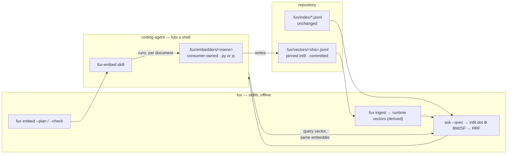
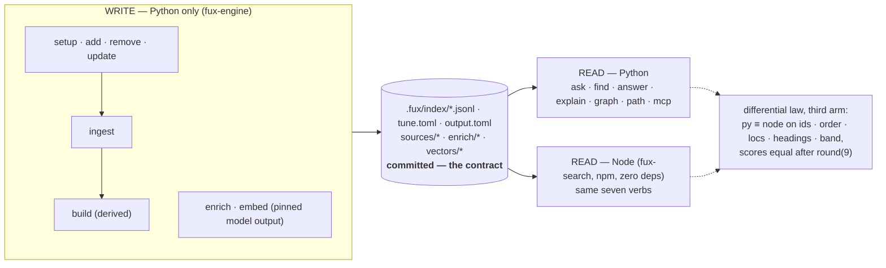

# Search v3

**Filed 2026-09-04 · Cowork (Opus).** Research + design + plan. Nothing here
is authorised to build; §8 is the plan Arpit ratifies, item by item, before
Opus executes it. Every claim about fux is grounded in a filed run or in
code; every claim about the field carries its source (§9).

**Model for every item in §8: Opus** — Arpit's instruction. Where a phase is
mechanical enough for Sonnet it says so, and Opus still owns the gate.

---

## 0 · One screen

**Three asks, one design.**

| ask | answer |
|---|---|
| **Better results from `ask` / `find` / `answer`** | Each verb loses somewhere specific and measured (§1). The fixes are query-time, tune-file or skill-text; **none changes the committed index** (§2–§4). Two are code fux already has, switched off or under-used. |
| **Embeddings via the coding agent (Claude Code / Kiro)** | The model cannot emit vectors; the agent can *run* an embedder. A pinned, committed vector plane fux reads but never computes, with the query vector supplied by the caller and rank-space fusion (§5). **Gated on a measurement that runs first** (W-106) — and the research says the win to look for is vocabulary mismatch, not negation. |
| **Read the index from Node.js with no Python** | A write/read split over the committed index: Python writes, Python **or** Node reads, and a third arm of the differential law keeps them equal (§6). The one silent trap is `log()` — libm and V8 disagree in the last ulp on ~1 % of inputs — so both sides get one portable `log` (§6.3). |

**Order of work (§8):** W-108 `answer` refers top-3 → W-106 the vector gate
(an afternoon, parallel) → W-107 the Node read plane → W-109 agent-side
expansion → W-110 doc2query enrichment → W-111 `ask`/`find` ergonomics →
W-112 the vector plane, only if W-106 passes.

**Diagrams:** [`../architecture-search-v3.svg`](../architecture-search-v3.svg)
is the target; the two shipped diagrams carry a *proposed — not built* band
pointing at it.

---

## 1 · Where the verbs lose today — evidence

- **Vocabulary gaps dominate.** Of the 18 golden failures that survived
  reranking, **18 are vocabulary gaps, 0 are ordering failures** — a
  term-membership check, not a judgement
  ([rerank-and-goldens](../regression/2026-08-24-rerank-and-goldens/ANALYSIS.md) §5).
- **Negation is unrepresentable by any bag.** *"current"* vs *"no longer
  current"* — every fix converges on word order
  ([dense-lane-gate](../regression/2026-08-24-dense-lane-gate/ANALYSIS.md) §3),
  and §9.5 shows dense bi-encoders are no better at it.
- **Enrichment as built is ≈ 0 blind** (+1, −1; two authors broke the same two
  queries by writing honest currency prose into a superseded record)
  ([second-author](../regression/2026-08-24-blind-enrichment-second-author/ANALYSIS.md)).
- **The reranker is the only intervention that helped and broke nothing**
  (+4/0) — and `tune.py` ships `rerank_weight = 0.0`. Already *Blocked on
  Arpit*; this document does not re-argue it.
- **`answer` inherits `recall@1`.** `0.5969` at k=1 vs `0.9535` at k=5 on the
  43 graded queries — 19 have 2–3 relevant documents
  ([first-recall](../regression/2026-08-28-first-recall/ANALYSIS.md)) — and
  `cmd_answer` calls `run_query(…, 1)` and refers only `results[0]`.
- **Nobody declines.** 0/20 on the blind unanswerable set
  ([v1-vs-head](../regression/2026-08-28-benchmark-v1-vs-head/ANALYSIS.md) F3).
  Already *Blocked on Arpit* (whether it gates).
- **4.38 % of top-5 orderings are decided by `docidx`** — by nothing
  ([rank-flip](../regression/2026-08-25-rank-flip-susceptibility/ANALYSIS.md) §2).
- **`fux_search` (MCP) returns `band` / `missing` unconditionally** and its
  description tells the agent to *report* the gap — never to search again
  (`src/fux/mcp.py`).

⚠ **Every number is from a 10-document playground or a generated corpus,
most runs `informed`.** Nothing is a claim at 10 000 documents; the blind
golden set at the design point (W-87 / W-96) gates every ship decision below.

---

## 2 · Per verb — the design

### 2.1 `answer` — the verb that claims

1. **Refer the top-3, not the top-1.** `refer()` already takes a list of
   citations and `_rescore` computes passage-level `df` across everything
   fetched — a fair cross-document passage contest exists and is called with
   one document. Fetch `min(3, len(results))` inside the existing byte budget
   (`per_doc_fraction` bounds each). Effect is bounded by the `recall@1 →
   recall@3` gap. Deterministic; offline for `file:`; the receipt already
   lists every citation.
2. **Proximity in the passage rescore.** `_rescore` is bag-of-words BM25 over
   passages; multiply by `rerank.passage_boost` (same analyzer, same chunker)
   so the passage that says the question back beats the one that scatters
   its words.
3. **Abstain here, and only here.** When Arpit rules on abstention, `answer`
   is the verb that gates (`answer: null` + the block that says why);
   `ask`/`find` keep reporting. A list is not a claim.
4. **No sentence extraction.** Over MCP the agent is the answerer
   (ADR-MCP); `answer`'s passages are its input.

### 2.2 `ask` — ranked documents for an agent

1. **Declared tie-break + `tie: true`.** Break exact ties on the `Weighting`
   inputs in a stated order — `superseded` first, recency, path priority, then
   id — and mark affected results. Same bytes on every machine; *"the same
   arbitrary answer everywhere"* becomes *"a stated answer everywhere"*.
2. **Teach the caller to retry.** One sentence in `fux_search`'s description
   and in `fux-usage`: `partial` + `missing` ⇒ re-search with the missing term
   replaced by the word the document would use, or pass `--expand` (§3).
3. **Not a per-passage index.** Analysed already: changes the committed
   format, still cannot see negation, and `rerank.boost()` already scores a
   document by its best passage.

### 2.3 `find` — locations for a pipe

Precision controls, not ranking cleverness. `--phrase "…"` (bigram adjacency
post-filter on local text via `rerank._adjacency_signal`; declines `url:`
offline, exactly as the reranker does) · `--under <dir>` (source-list prefix)
· `--all` (every query term present in `terms` — grep users expect AND).
**Not** fuzzy/prefix matching: the committed plane stores term *hashes*, so
prefix enumeration needs a second committed structure — say it in `missing`.

---

## 3 · Cross-verb: agent-side query expansion (`--expand`)

**The searcher's word is not in the document; a model can guess the
document's words; fux does not call a model — but the caller is one.**

- **Literature.** Query2doc: LLM pseudo-passage appended to the query,
  **+3 % to +15 %** BM25 on MS MARCO / TREC DL, no fine-tuning
  ([Wang et al. 2023](https://arxiv.org/abs/2303.07678)). CoT prompts are
  the best expansion prompt for BM25 and beat classical PRF
  ([Jagerman et al. 2023](https://arxiv.org/abs/2305.03653)). RM3 — the
  model-free alternative — is known to *hurt* on short-passage corpora and
  help on long newswire; it may be measured, never assumed.
- **Surface.** `fux ask "<q>" --expand "<pseudo passage>"` and an MCP input.
  The expansion is analyzed by the same analyzer and scored at a **fixed lower
  weight** — Query2doc's 1:5 ratio, made a `[ranking] expand_weight` key.
  Deterministic: same strings in, same bytes out. The receipt records the
  expansion verbatim; `fux verify` replays it; L8 untouched.
- **Multi-query RRF** (`-q a -q b -q c`, k = 60) as the second step. ⚠ The
  RRF math (`query/fuse.py`) was removed on Arpit's ruling (W-79) for having
  no caller; ADR-PORT-LIST rule 1 says reviving it needs a **new record** —
  this time it has a lexical multi-query caller.
- **Does not fix negation.** Expansion adds words; it cannot subtract
  *"current"* from a superseded record. That stays with `supersedes:` +
  `superseded_weight` (W-94).

---

## 4 · Cross-verb: re-aim `fux enrich` at doc2query

**The defect is in the text, not the mechanism.** Three skill changes, none
to L3:

1. **Generate questions, not prose.** doc2query's unit is *"a question this
   passage answers"*, 5–10 per document, one per line. docTTTTTquery lifted
   BM25 MRR@10 **0.184 → 0.265** with 10 questions per passage
   ([Nogueira & Lin 2019](https://cs.uwaterloo.ca/~jimmylin/publications/Nogueira_Lin_2019_docTTTTTquery-v2.pdf)).
2. **Filter by self-retrieval (doc2query−−).** Dropping generated queries a
   relevance model scores low improved BM25 by **up to 16 %** and cut the
   index 33 % ([Gospodinov et al. 2023](https://arxiv.org/abs/2301.03266)).
   Fux's relevance model is its own index: `fux enrich --check` runs each
   question through `rank()` and **refuses** any that does not place its own
   document in the top-*k*. Offline, stdlib, deterministic.
3. **Currency goes in frontmatter, never prose.** The skill writes
   `supersedes:` / superseded-by as a declared key — the sentence is what
   broke `q015`. Option 1 of the second-author analysis, never built.

Gate: the `none` / `placebo` / `real` arms from
`2026-08-28-placebo-and-seal`, re-graded on `recall@k`, blind author, net ≥ 6
discordant (ADR-RS decision 19).

---

## 5 · The vector plane an agent can produce

### 5.1 The claim, corrected by the research

A skill cannot make the model emit vectors; it can make the agent **run** a
consumer-owned embedder. That is ADR-FETCHER's boundary a third time. Two
research results (§9.2, §9.5) sharpen what to expect:

- **Where it should pay:** vocabulary mismatch and paraphrase — which is the
  18/18 failure class. ⚠ An earlier draft named `q015` (negation) as the
  litmus; **that was wrong.** NevIR measures bi-encoders at 7–11 % pairwise
  accuracy on negation against a 25 % random baseline. The gate (W-106) is
  judged on the vocabulary-gap failures.
- **Byte-identity across machines is not achievable for vectors** — ONNX CPU
  inference differs in low bits per ISA and version (§9.2). So determinism is
  defined as *the committed bytes are reused*, never *re-embedding
  reproduces them*. Same as enrichment.

### 5.2 The flow



<details><summary>ASCII twin</summary>

```
 fux embed --plan ──► [skill] ──► .fux/embedders/<name>  (consumer code, py or js)
                                         │ writes
                                         ▼
                            .fux/vectors/<sha>.jsonl  (committed, pinned, int8)
                                         │
                                         ▼
                                   fux ingest  ──► .fux/runtime/vectors (derived)
                                                              │
 agent ──(query vector, same embedder)──► fux ask --qvec ──► int8 dot ⊕ BM25F ──► RRF ──► agent
```

</details>

### 5.3 The pieces

- **`.fux/embedders/<name>.{py,js}`** — written once by `fux setup --embedder`,
  never rewritten. Contract: stdin one JSON chunk per line → stdout
  `{"chunk": n, "v": [int8…], "scale": f}`; `--identify` prints
  `{"model","revision","dtype","dim","pooling","normalize"}`. Two templates:
  `local-py` (`sentence-transformers`) and `local-js`
  (`@huggingface/transformers`, ONNX — **no Python**; `dtype: 'q8'`,
  `pooling: 'mean'`, `normalize: true`). Candidate models (§9.1):
  `bge-small-en-v1.5` (MIT, 384-d, 34 MB q8), `e5-small-v2` (MIT, needs
  `query:`/`passage:` prefixes), `nomic-embed-text-v1.5` (Apache-2.0, 768-d,
  137 MB q8). **Pin repo + revision + dtype file** — different files give
  different numbers.
- **`.fux/vectors/<sha>.jsonl`** — header `{"_format":"fux.vectors.v1",
  source, source_sha, model, revision, dtype, dim, pooling, chunker, chunks}`
  then one `{"chunk", "scale", "v"}` line per passage. Per-vector symmetric
  int8 (`scale = 127 / max|x|`, `q = round(x·scale)`); int8 retains ≈ 99.3 %
  of float32 nDCG@10 (§9.3). Sha-keyed like enrichment: edit → orphaned, not
  wrong. `fux embed --check` refuses a scope mixing models, a `chunks` that
  disagrees with `refer/_chunk.py` for that sha, or a `v` outside `[-128,127]`.
  Size: 384 B/vector raw, ~1.4 KB as JSON text; tens of MB at 10 000 docs if
  every scope opts in — **opt-in per source line (`embed=true`)**, exactly as
  `enrich=true`. Hashed-meta sources get none unless the line says so
  (embedding inversion is a *demonstrated* risk on hashed records — CHANGELOG
  0.34.0, P5).
- **`fux ingest`** folds vectors into `.fux/runtime/` only. **Nothing about a
  vector reaches `.fux/index/`**; the differential law's two paths are
  untouched.
- **`fux ask --qvec <file>` / MCP `qvec`** — int32-accumulated int8 dot per
  chunk, **max-sim per document**, then
  `score(d) = 1/(60+rank_bm25(d)) + 1/(60+rank_vec(d))` (§9.4). Without
  `--qvec`: today's bytes. The receipt records `--identify`'s output; `fux
  verify` reports `unverifiable` when the embedder differs.

### 5.4 The laws

| law | holds | how |
|---|---|---|
| L1 | yes | fux imports nothing; integer arithmetic |
| L2 / L5 | conditional | vectors are statistics; inversion risk ⇒ hashed sources opt in explicitly |
| L3 | yes | pinned files; no model in `fux ingest` |
| L4 | yes for fux | the embedder's download is the consumer's process, declared in the skill |
| L8 | yes | `--qvec` and the embedder identity live in the receipt (gitignored) |

### 5.5 Costs that are real and not fux's

A 34–137 MB model on every machine that wants `--qvec`, behind a proxy, on a
Windows fleet; committed size; a second thing that can orphan on edit
(`fux doctor` gains a line).

---

## 6 · The Node read plane

### 6.1 Purpose and split

A frontend project or a Node pipeline should *read* a fux index without
installing Python. **Python remains the only writer.** The committed index is
the contract.



<details><summary>ASCII twin</summary>

```
  WRITE (Python only)                 the contract                       READ (either)
  setup/add/remove/update ─┐                                         ┌─► python: fux ask/find/answer/graph/mcp
  ingest                   ├─► .fux/index/*.jsonl, tune, output,     │
  build (derived only)     │   sources/*, enrich/*, vectors/*        ├─► node:   npx fux-search ask/find/answer/graph/mcp
  enrich / embed (pinned) ─┘   (committed)                           └──── differential law: py ≡ node
```

</details>

**Three flows.** Local dev: Python writes via hook/`fux update`; the agent
reads via whichever MCP its host has. A Python-less frontend/CI pipeline:
`npx fux-search find|answer|mcp` against an index somebody with Python
committed. A Python-less team: one machine or one CI container with Python
runs `fux update` and pushes; the write side is **not** being ported and this
document says so.

### 6.2 Scope and what Node reads

`find`, `ask`, `answer`, `explain`/`graph`/`path`, `mcp`. Not `ingest`,
`build`, `add/remove/update`, `enrich`, `embed`, `doctor`, `setup`.

| plane | Node |
|---|---|
| `.fux/index/*.jsonl` | reads — scan path; refuses an unknown `_format` |
| `tune.toml`, `output.toml` | reads — hand-rolled TOML subset (§6.3) |
| `sources/dirs` | reads, for `archived` |
| `enrich/` | no — folded into `ctx` at ingest |
| `.fux/runtime/` (Python's) | **no** — rebuilds the graph plane in memory; must hash identically to Python's `graph.json` |
| `acquired/` | optional — `answer` on `url:` uses the blob or falls back to `source: index`; **Node never fetches** |
| `fetchers/*.py` | no |
| `vectors/` (§5) | reads, when W-112 exists |

### 6.3 The five silent divergences — each with its fix

1. **`term_hash` is BLAKE2b-8.** Node ships only `blake2b512`; BLAKE2b's
   parameter block puts the digest length in the IV, so truncating is a
   different function. Hand-roll BLAKE2b (RFC 7693) using **32-bit halves**,
   not BigInt (~150–300 lines; `emilbayes/blake2b` is the transcription
   template, MIT). Pin against Python for `n ∈ {1, 8, 20}` and RFC 7693
   Appendix A.
2. **The analyzer.** Identifier split *before* lowercasing, the boundary
   regex, stopwords, Porter with `should_stem` exclusions. Pin with the
   Porter test vocabulary (`voc.txt`/`output.txt`, §9.6) **and** with every
   distinct term of the playground index hashed both sides — the second is
   the one that catches fux's own departures from textbook Porter.
3. **`log()`** — the trap the earlier draft missed. **Measured: V8's
   `Math.log` (fdlibm) and glibc's `log` differ in the last ulp on 1.1 % of
   inputs** (`log(3)`: `…096` vs `…098`); macOS libm is a third answer. That
   reaches every idf. **Fix: one portable `log` in both runtimes** — range
   reduction via the IEEE bit pattern (`math.frexp` / `DataView`) and an
   `atanh`-series polynomial using only `+ − × ÷`, which are correctly
   rounded everywhere. Same sequence of ops in Python and JS ⇒ same bits on
   every OS and ISA. ⚠ This changes Python's own scores in the last ulp —
   a **fux-wide analyzer-class change** (ADR-RANKING amendment, differential
   re-run, goldens re-graded) — and it is also the honest fix for the
   `1.9e-6` cross-arch drift the rank-flip run already recorded. Decision
   for Arpit in W-107 §1: portable `log` (byte identity, one Python change)
   vs tolerance comparison (no Python change, no byte identity).
4. **Float formatting and rounding.** `round(x, 9)` is round-half-even on the
   exact binary value; `Number(x.toFixed(9))` matches on 200 000 random
   doubles and fails only on exact binary ties — detect via `toFixed(20)`
   and resolve to even. `--json` prints Python `repr` (`1e-05`, `2.0`,
   exponent when `e < -4 or e ≥ 16`); JS prints `1e-5`, `2`, thresholds
   `−6/21`. Both are shortest-round-trip, so a 40-line re-layout closes it.
5. **`tune.toml`.** Node has no TOML. Hand-roll the subset fux writes —
   `[a.b]`, bare keys, integer/float/basic-string/bool, comments — and
   **reject loudly** underscores, hex/octal/binary, leading zeros, `inf/nan`,
   `.5`/`5.`, literal/multi-line strings, arrays, inline tables, dotted keys,
   datetimes, duplicates. Absent file = every default; unreadable = error.

Plus: sort stability (ES2019, Node ≥ 11 — fine) and encoding the Python key
tuple `(-round(s, 9), id)` exactly in the comparator.

### 6.4 Distribution and governance

- npm **`fux-search`** (free; `fux` is a 2016 UI library; `fux-engine` is
  also free on npm; the `@fux` scope would need the org). Version tracks the
  **index schema** it reads (`fux.index.v2`), not the Python release.
- One ESM file, `#!/usr/bin/env node`, Node ≥ 20, no dependencies, no build
  step. Lives in this repo under `node/` so the goldens, the harness and CI
  see both implementations in one change.
- **`ADR-NODE-SEARCH`** owns `node/`; the ownership table and
  `tests/test_adr_ownership.py` change in the same commit; the freshness
  test maps each Python module to its Node twin so a change to one without
  the other fails CI.
- MCP: legacy handshake (`initialize` → `notifications/initialized`,
  `tools/list`, `tools/call`, `ping`), newline-delimited JSON-RPC on stdio,
  nothing but messages on stdout. Tool descriptions generated from one source
  shared with Python.
- Startup: `readFileSync` + split + `JSON.parse` ≈ 70 MB/s (measured); a
  10 000-document index parses in ~1 s. A Node-side cache (`--fast`) is
  deferred until that is measured at the design point.

---

## 7 · Target architecture

**Full picture:** [`../architecture-search-v3.svg`](../architecture-search-v3.svg).
The two shipped diagrams ([high-level](../architecture-high-level.svg),
[detailed](../architecture-detailed.svg)) now carry a dashed *proposed — not
built* band that names this document; nothing proposed is drawn as shipped.

What changes in the mechanism, in one table:

| plane | today | v3 |
|---|---|---|
| committed | index · sources · enrich · tune · output | **+ `vectors/` (opt-in, pinned int8)** · enrich bodies become question lists |
| derived (`runtime/`) | postings · docs · stats · graph · caches | **+ runtime vectors** · **+ `runtime/node/` later, if measured** |
| query | analyzer → scan/accel → BM25F → rerank (off) → refer(top-1) | **+ `--expand` slot · + `-q` multi-query RRF · + `--qvec` lane → RRF · declared ties · refer(top-3) with proximity** |
| readers | Python | **Python or Node**, one contract, one differential law with three arms |
| skills | `fux-usage`, `fux-enrich` | **`fux-enrich` re-aimed at doc2query + self-retrieval filter · `fux-embed` · `fux-usage` gains the retry rule** |
| laws | L1–L8 | unchanged; `log()` becomes portable (L3 strengthened) |

---

## 8 · The implementation plan

**Numbering:** W-106 … W-112 (last used: W-105). Each has a detail file under
[`../open/`](../open/README.md) and a row in [`../OPEN-WORK.md`](../OPEN-WORK.md),
lane `arpit` until ratified, then `agent`. **Model: Opus** on every item.

| id | item | depends on | record(s) | size |
|---|---|---|---|---|
| **W-108** | `answer` refers top-3 + proximity in the passage rescore | — | ADR-ANSWER · ADR-REFER · ADR-RERANK | S |
| **W-106** | the vector gate — contextual embedder vs DENSE-CHUNK's frozen bar, scratch only | — | none (a run) | S |
| **W-107** | the Node read plane (`node/`, `fux-search`) in four phases | portable-`log` decision | **ADR-NODE-SEARCH** (new) · ADR-RANKING (if portable `log`) · ADR-MCP | XL |
| **W-109** | `--expand` term slot + `-q` multi-query RRF | — | ADR-ASK · ADR-TUNE · **ADR-EXPAND** (new; revives RRF under a new record) | M |
| **W-110** | `fux-enrich` → doc2query + self-retrieval filter in `--check` | — | ADR-ENRICH | M |
| **W-111** | declared tie-break + `tie` · `find --phrase/--under/--all` · retry rule in `fux_search`/`fux-usage` | — | ADR-ASK · ADR-FIND · ADR-CLI · ADR-RANKING · ADR-MCP | M |
| **W-112** | the vector plane (`embed`, `vectors/`, `--qvec`, RRF) | **W-106 PASS** · W-109's RRF | **ADR-VECTORS** (new) · ADR-DOTFUX · ADR-INGEST · ADR-ASK | L |

Three defaults already on *Blocked on Arpit* are referenced, not
duplicated: `rerank_weight`, `superseded_weight`, abstention.

### W-108 — `answer` refers top-3 *(first: smallest, highest value)*

- **DoD.** `cmd_answer` runs `run_query(…, 3)`; `answer_via_refer` takes the
  list; `_rescore` multiplies by `passage_boost`; `--json` unchanged in shape
  (`citation` = the winning passage's doc); receipt lists all fetched shas.
  Golden diff filed as `informed`; per-query rows; `tests_e2e` golden updated
  deliberately.
- **Gate.** No hand-graded golden that passed now fails; `recall@1`
  recomputed on the 43 (report the number, claim nothing at 10k).
- **Hazards.** Byte budget: three documents share `budget` — assert the
  assembled bytes never exceed today's; `url:` documents with no fetcher
  degrade per-doc, never whole-answer.

### W-106 — the vector gate *(parallel; scratch; no fux code)*

- **DoD.** A script under `tools/vector-gate/` (dev extra, not runtime):
  chunk the 10 playground docs with `refer._chunk`; embed chunks and 50
  queries with `bge-small-en-v1.5` q8 via `@huggingface/transformers` **and**
  via `sentence-transformers`; int8 per-vector quantize; max-sim per doc; RRF
  with today's BM25F ranks; grade. Filed under `work/regression/`, per-query
  rows, `informed`, both embedder implementations as separate arms, plus a
  **two-architecture** arm for the query vectors (discordant count).
- **Bar.** DENSE-CHUNK's frozen `>= 3 fixed / 0 broken`, **judged on the
  vocabulary-gap failures**; negation queries reported but not expected.
- **Outcome.** PASS → W-112 is unblocked and a compare doc (*vectors* vs
  *doc2query*) is written. FAIL → §5 is archived with the verdict linked.

### W-107 — the Node read plane

- **Phase 0 (Opus, decision):** the `log()` fork. Measure Python-vs-Node
  score divergence on the playground and lab corpora *as is*; write
  `PRE-REGISTRATION-NODE.md` with the three-arm law; Arpit picks portable
  `log` or tolerance. If portable: land `fux/query/portable_math.py` first,
  ADR-RANKING amended, differential and goldens re-run, **then** Node.
- **Phase 1 — `find`.** `node/fux-search.mjs`: BLAKE2b, analyzer + stemmer,
  shard reader, BM25F, `Weighting`, TOML subset, `round`/`repr` shims, sort.
  Pinned by: hash vectors, the term dump, `find --json` equality over all
  goldens on both corpora.
- **Phase 2 — `ask` + `answer`.** Display title, headings, confidence,
  `--why`; chunker, rescore (with W-108's proximity), assemble, receipt.
  `answer` on `url:` = acquired blob or index path.
- **Phase 3 — graph + `mcp`.** Edges → label propagation → PPR/routes; plane
  digest equals Python's `graph.json`. MCP legacy handshake; tool descriptions
  from a shared JSON so the two servers cannot drift.
- **Phase 4 — ship.** `ADR-NODE-SEARCH`, ownership twin, CI matrix (Node 20/22
  × x86-64/arm64), npm publish `fux-search`, README front door.
- **Gate (pre-registered before Phase 1):** 0 discordant rows over every
  golden × every verb × both corpora × both ISAs; `graph.json` digest equal;
  Node scan p95 at 10 000 documents stated before measured.
- **Hazards.** Anything the port "improves" is a divergence; `answer` must
  never fetch; a `_format` bump in Python without a Node release is a broken
  clone — the version policy in §6.4 is the guard.

### W-109 — `--expand` and multi-query RRF

- **DoD.** `--expand` (CLI + MCP input) analyzed with the shared analyzer,
  scored at `[ranking] expand_weight` (default from Query2doc's 1:5, i.e.
  `0.2`; documented as unmeasured until graded); `-q` repeatable with RRF
  `k = 60`; receipt records both; `--why` labels which terms came from the
  expansion. **ADR-EXPAND** is the new record RRF's revival requires.
- **Gate.** Blind author writes expansions for the 50 goldens without
  seeing judgments; net ≥ 6 discordant; 0 broken among goldens that pass
  without expansion.
- **Hazards.** The expansion must never *retrieve* on its own when the
  original query scores nothing (an empty-lexical + expansion-only hit is a
  hallucinated citation); `band` reports coverage of the **original** terms.

### W-110 — doc2query enrichment

- **DoD.** `ENRICH-SKILL.md` rewritten (questions, one per line; currency in
  frontmatter); `fux enrich --check` self-retrieval filter with the top-*k*
  stated in ADR-ENRICH; `queue.tsv` unchanged; existing prose bodies stay
  valid (the filter applies to lines that parse as questions).
- **Gate.** The three placebo arms on `recall@k`, blind author, net ≥ 6.

### W-111 — `ask` / `find` ergonomics

- **DoD.** Tie-break order recorded in ADR-RANKING and applied in `rank()`
  (both candidate paths, one sort key); `tie` on results and in the schema;
  `find --phrase/--under/--all`; the retry sentence in `mcp.py` and
  `fux-usage`. Differential law re-run (a tie-break is a sort-key change).
- **Hazards.** `--all` must be evaluated on `terms` (committed), never on
  fetched text; `--phrase` declines `url:` offline exactly as the reranker.

### W-112 — the vector plane *(only on W-106 PASS)*

- **DoD.** `fux setup --embedder local-py|local-js`; `fux embed --plan/--check`;
  `.fux/vectors/` declared in ADR-DOTFUX's table; ingest fold into
  `runtime/`; `--qvec` + RRF; receipt + `verify`; `fux doctor` orphan line;
  `fux-embed` skill mirroring `fux-enrich`'s discipline; Node reader gains
  the lane. Format `fux.vectors.v1` pinned by a schema file.
- **Gate.** The W-106 bar re-run on the shipped code path, plus the
  differential law with and without `--qvec`.

---

## 9 · Research appendix

### 9.1 Embedders under Node
`@huggingface/transformers` v3 runs ONNX in Node; `pipeline('feature-extraction',
id, { dtype: 'q8' })` then `ex(texts, { pooling: 'mean', normalize: true })`.
Sizes (fp32 / q8): MiniLM-L6 90/23 MB · bge-small 133/34 MB · e5-small
133/34 MB · nomic-v1.5 547/137 MB (768-d). Licences: bge MIT · e5 MIT · nomic
Apache-2.0. Python: `SentenceTransformer(id).encode(texts, normalize_embeddings=True)`.
*Sources:* [dtypes guide](https://huggingface.co/docs/transformers.js/guides/dtypes) ·
[v3 blog](https://huggingface.co/blog/transformersjs-v3) ·
[bge-small onnx](https://huggingface.co/Xenova/bge-small-en-v1.5/tree/main/onnx) ·
[nomic](https://huggingface.co/nomic-ai/nomic-embed-text-v1.5).

### 9.2 ONNX cross-machine determinism
Not bit-identical: ORT #5667 shows ~2e-7 relative differences between two
machines; Intel confirms AVX-512 vs AVX2 kernels differ; int8 kernels
diverge further (VNNI vs `VPMADDUBSW` saturation, ORT #14642). Thread count
changes reduction order. *Sources:*
[ORT #5667](https://github.com/microsoft/onnxruntime/issues/5667) ·
[ORT #14642](https://github.com/microsoft/onnxruntime/issues/14642) ·
[ORT quantization docs](https://onnxruntime.ai/docs/performance/model-optimizations/quantization.html).

### 9.3 int8 quantization
Scalar int8 retains ≈ 99.3 % of float32 nDCG@10 (15 MTEB retrieval sets);
per-vector symmetric `scale = 127/max|x|` needs no calibration; store the
scale per vector. *Sources:*
[HF embedding-quantization](https://huggingface.co/blog/embedding-quantization) ·
[sbert docs](https://sbert.net/examples/sentence_transformer/applications/embedding-quantization/README.html).

### 9.4 RRF
Cormack, Clarke & Büttcher 2009, `k = 60`; Elastic on BEIR: RRF of BM25 +
semantic ≥ BM25 on every dataset (+18 % over BM25 alone). Hybrid helps most
when the lanes are comparable; BM25-only stays the fallback. *Sources:*
[RRF paper](https://cormack.uwaterloo.ca/cormacksigir09-rrf.pdf) ·
[Elastic hybrid](https://www.elastic.co/search-labs/blog/improving-information-retrieval-elastic-stack-hybrid).

### 9.5 Negation
NevIR (EACL 2024): random 25 %; TF-IDF 2 %; SPLADE++ 8–9 %; bi-encoders
7–11 %; cross-encoders ≈ 50 %; listwise LLM rerankers best (o3-mini 77 %,
SIGIR 2025 reproduction). **Dense bi-encoders do not solve currency; metadata
does.** *Sources:* [NevIR](https://aclanthology.org/2024.eacl-long.139.pdf) ·
[reproduction](https://arxiv.org/html/2502.13506).

### 9.6 Node port mechanics
BLAKE2b digest length lives in the parameter block (RFC 7693 §2.5); Node
`getHashes()` → `blake2b512`, `blake2s256` only; 32-bit halves beat BigInt.
Python `repr` thresholds `-4 ≤ e < 16`, `.0` kept, two-digit exponent; JS
`-6 ≤ e < 21`. `round(x, 9)` = correctly rounded half-even on the exact
value; `toFixed` is half-up on exact ties. `Math.log` vs glibc `log`:
1 095/100 000 last-ulp disagreements measured; glibc ≥ 2.28 is ~0.507 ulp;
V8 `main` is moving to LLVM-libc's correctly rounded `log`. Porter reference
+ `voc.txt`/`output.txt` at tartarus.org and the Snowball data repo. TOML 1.0
number rules to reject. MCP stdio: newline-delimited JSON-RPC, legacy
`initialize` handshake still what shipping clients speak. JSONL read ≈ 70 MB/s.
`fux-search` free on npm. *Sources:*
[RFC 7693](https://www.rfc-editor.org/rfc/rfc7693#section-2.5) ·
[Node crypto](https://nodejs.org/api/crypto.html#cryptogethashes) ·
[emilbayes/blake2b](https://github.com/emilbayes/blake2b/blob/master/index.js) ·
[pystrtod.c](https://github.com/python/cpython/blob/main/Python/pystrtod.c) ·
[ECMA-262 Number::toString](https://tc39.es/ecma262/#sec-numeric-types-number-tostring) ·
[glibc e_log.c](https://github.com/bminor/glibc/blob/master/sysdeps/ieee754/dbl-64/e_log.c) ·
[V8 ieee754.cc](https://github.com/v8/v8/blob/main/src/base/ieee754.cc) ·
[LLVM D150131](https://reviews.llvm.org/D150131) ·
[Porter](https://tartarus.org/martin/PorterStemmer/) ·
[Snowball porter data](https://github.com/snowballstem/snowball-data/tree/master/porter) ·
[TOML 1.0](https://toml.io/en/v1.0.0) ·
[MCP transports](https://modelcontextprotocol.io/specification/2025-06-18/basic/transports) ·
[MCP lifecycle](https://modelcontextprotocol.io/specification/2025-06-18/basic/lifecycle).

### 9.7 Retrieval quality (from the first pass)
[Query2doc](https://arxiv.org/abs/2303.07678) · [LLM query expansion](https://arxiv.org/abs/2305.03653) ·
[Doc2Query−−](https://arxiv.org/abs/2301.03266) · [docTTTTTquery](https://cs.uwaterloo.ca/~jimmylin/publications/Nogueira_Lin_2019_docTTTTTquery-v2.pdf) ·
[Anserini MS MARCO](https://github.com/castorini/anserini/blob/master/docs/experiments-msmarco-passage.md) ·
[RankZephyr](https://arxiv.org/html/2312.02724v1) ·
[Claude docs — embeddings](https://platform.claude.com/docs/en/build-with-claude/embeddings).

---

## 10 · What this document corrects from its three predecessors

- **`q015` is not the vector litmus** — dense bi-encoders fail negation too
  (§9.5). The gate is judged on vocabulary-gap failures.
- **Byte-identical Node `--json` needs a portable `log`** — libm and V8
  disagree in the last ulp on ~1 % of inputs (§6.3). The earlier draft called
  this "usually invisible"; it is a decision, not a footnote.
- **RRF's revival needs a new record** (ADR-PORT-LIST rule 1) — ADR-EXPAND.
- **ONNX vectors are never byte-identical across machines** — determinism is
  *reuse of committed bytes*, stated as such (§5.1).

## Graduation

Arpit ratifies §8 item by item. W-108 needs no fork and can start on
ratification; W-107 Phase 0 and W-106 are measurements and can start the
same day; W-112 waits for W-106's verdict.
