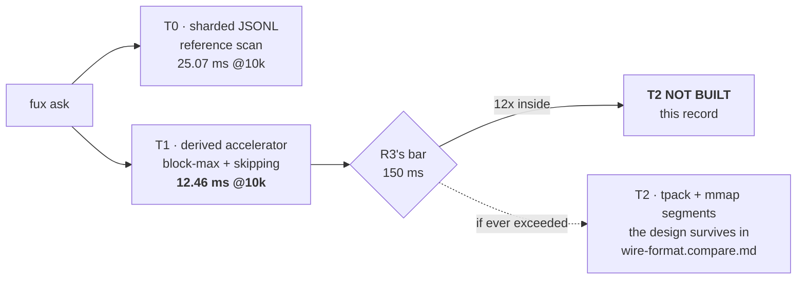

# T2 segments — measured, and not built

> ## MOVED OUT OF `docs/adr/` ON 2026-08-22, BY ARPIT'S INSTRUCTION.
>
> This was **ADR-T2-SEGMENTS (0037)**, `accepted`. Arpit ruled it should not be
> a record: *"move the document to proposals and remove the ADR completely."*
> **Number 0037 is retired and is never reused.**
>
> **Read this as a kept idea, not as a decision with force.** A proposal has no
> veto condition and nothing enforces it. What was a veto — *reopen if a
> measured warm p95 exceeds 150 ms* — is now a **graduation trigger** below, and
> the difference is real: a veto is checked, a trigger is remembered.
>
> ### ⚠ Two departures recorded so they are not mistaken for precedent
>
> **1. CLAUDE.md says *"the decisions that rest on a verdict live in `docs/adr/`
> and cite it."* This no longer does.** [R9](../regression/2026-08-22-r9-t2-at-10k/VERDICT.md)
> is a filed verdict whose decision now lives in `work/proposals/`. **That is a
> departure from a stated law, taken on Arpit's explicit instruction after the
> consequence was put in front of him — not an interpretation, and not a new
> general rule.** The law is unchanged for every other verdict.
>
> **2. Two frozen files still cite `ADR-T2-SEGMENTS` and always will.**
> [`tools/t2-eval/PRE-REGISTRATION.md`](../../tools/t2-eval/PRE-REGISTRATION.md)
> names it in its own verdict table, and R9's `VERDICT.md` cites its old path.
> **Neither may be edited** — a frozen pre-registration and a filed verdict are
> the two things this project never rewrites. **Their references are stale by
> design.** Repairing them would cost more than the staleness: it would mean
> editing the instrument and the ruling to match a later filing decision, which
> is the exact move the freeze exists to prevent.
>
> **Nothing measured changed.** R9 passed at 12.46 ms against a 150 ms bar. T2
> is still not built, and no code was added or removed by this move.

---

## §1 — For humans

**Fux was planned to grow a third storage tier.** T0 is sharded JSONL answered
by a scan; T1 adds the derived accelerator; **T2** was to swap `terms` for a
binary `tpack` property and serve queries from byte-aligned, memory-mapped
segments. It was scoped for M6 and its name was reserved a milestone in
advance.

**It is not being built, because it was measured first.**
[R9-T2-AT-10K](../regression/2026-08-22-r9-t2-at-10k/VERDICT.md)
answers worst-case queries in **12.46 ms** at 10 000 documents against a
**150 ms** bar — the bar R3 set for T1 in the first place. Twelve times inside
it. A tier exists to buy latency that is not otherwise available; at the design
point there is nothing to buy.

**What makes this a decision rather than a deferral** is that the reopen
condition is a *number*, not a size: T2 becomes necessary when a measured
worst-case p95 crosses 150 ms, whatever corpus produces it. Nobody has to
remember to revisit this at 50 000 documents — the bar checks itself.



<details>
<summary><b>ASCII twin</b> — the same diagram, for terminals, diffs, and any reader without a Mermaid renderer</summary>

```text
  fux ask --+--> T0 . sharded JSONL, reference scan ......... 25.07 ms @10k
            |
            +--> T1 . derived accelerator (block-max+skip) .. 12.46 ms @10k
                        |
                        v
                  R3's bar: 150 ms
                        |
       12x inside -------+------- if ever exceeded (a number, not a size)
            |                              |
            v                              v
    T2 NOT BUILT                  T2 . tpack + mmap segments
     (this record)                design kept in wire-format.compare.md
```

</details>

## §2 — For agents

### Context

**T2's justification was written at a design point that no longer holds.**
Byte-aligned mmap segments were motivated by query latency at 10⁵–10⁶
documents. On 2026-08-21 Arpit moved the design point to **10 000**, and W-26
was re-scoped with an explicit instruction: *"The first question this milestone
now asks is whether T2 earns its place at 10k, and 'no' is a legitimate answer
that closes it with an ADR instead of a build."*

Three facts framed the question:

1. **R3 measured T1 at 27.2 ms worst-case p95 on 8 870 real RFCs** against a
   pre-registered 150 ms bar — a corpus size within 12 % of the design point.
   R3's own analysis said *"T2 (M6) must not be pre-built… the tripwire did not
   fire"* and owed M6 a re-measurement.
2. **R3's corpus no longer exists** (W-56 lost the lab), so that number could
   not be cited as evidence about today. A new measurement was required.
3. **T2 lands on the maintenance path R5 just failed.** 47.6 % of R5's failing
   44 s was `fux build`; a third derived tier adds to exactly that. Building T2
   speculatively would have made a failing gate worse.

### Decision

**1. T2 is not built at the 10 000-document design point.** Measured, not
assumed: [R9-T2-AT-10K](../regression/2026-08-22-r9-t2-at-10k/VERDICT.md)
is a **PASS** at 12.46 ms worst-case warm p95 against 150 ms, pre-registered in
[`tools/t2-eval/PRE-REGISTRATION.md`](../../tools/t2-eval/PRE-REGISTRATION.md)
before the run.

**2. The bar was reused, never re-derived.** R9's threshold is R3's own
150 ms, copied verbatim to a new corpus size. Choosing a fresh number after
having seen R3's 27.2 ms is the inversion the pre-registration rule exists to
stop, and `graph-plane-format.compare.md` §6 had already recommended the R3
precedent for exactly this reason.

**3. The `[index] tier = t0|t1|t2|auto` knob is not created.** It appears in
[`index-format.compare.md`](../compare/index-format.compare.md) §3 and
has never existed in code. **A knob with two reachable values and no third
implementation is surface pretending to be capability**, and the rule
*"tier-auto flips by measurement, never by hand"* governs nothing until there
is a tier to flip to. When T2 is built, the knob is part of building it.

**4. The T2 design is kept, not deleted.** Its internals live in
`wire-format.compare.md` (archived 2026-08-25) — BIC
postings, 4-bit impacts, front-coded ledger, 128-entry mmap blocks — and its
tier row in `index-format.compare.md` §3. **Nothing is retracted**; what is
recorded is that the escape hatch stays unopened. The BIC codec remains fenced
to T2 (W-26's hazard) and must not leak into the committed plane.

**5. This record does not touch R7.** R7 is the committed-size prediction, its
budget was retired with the design point, and **its re-derivation is Arpit's
call** — filed as a blocker, not guessed. R9 measured index size (14.2 MB raw /
2.3 MB packed at 10 000 documents) purely as characterisation for the paper's
§5, labelled post-hoc in the report's own JSON key. **A T2 decision taken on
latency says nothing about size**, and conflating them is how a size problem
gets an answer built for a speed problem.

### Consequences

- **M6's largest deliverable is not built, and the milestone is smaller than
  planned.** `tpack` writer/reader, mmap segments, the partial-clone deployment
  doc and external-shards-only committing all fall away with the tier. What
  remains of W-26 is the paper rewrite and R7's re-derivation.
- **`index-format.compare.md` §3's tier table now describes one unbuilt tier.**
  Its "T1 | ≤ ~200k" boundary was an estimate from the B1–B6 session benches,
  never a measurement; R9 puts a measured point at 10 000 and a linear curve
  through 1 000, which is the first real data on that row.
- **The reopen condition is checkable today**, which is the property
  [`README.md`](README.md) §veto conventions requires: run the harness, read
  one number. No event to await.
- **A 12× margin makes the corpus caveat tolerable rather than irrelevant.**
  R9's corpus is synthetic and 18× lighter per document than R3's; the judged
  quantity is `df`-bound rather than bytes-bound, and a density correction puts
  R9 within 15 % of R3. That is a consistency argument, not a measurement on
  real prose at 10 000 documents — which does not exist and is owed.
- **The graph plane's option D loses its vehicle**, exactly as
  [`graph-plane-format.compare.md`](../compare/graph-plane-format.compare.md)
  predicted: *"If the answer is no, option D has no vehicle."* That doc already
  ruled A and said B, not D, is what 50 000 inherits. Nothing to change there;
  noted so the prediction is seen to have landed.

### Alternatives considered

- **Build T2 anyway, because it is on the plan.** Rejected on the measurement
  and on cost: it is the largest thing in M6, it adds a third derived tier to
  the maintenance path R5 failed on, and no number asks for it. Building a tier
  a measurement says is unnecessary is the "build the fun part first" failure
  the plan exists to avoid.
- **Build a prototype `tpack` writer only, to de-risk later work.** Rejected:
  an unused format with no reader is a maintenance liability and a second
  source of truth about record shape, and `index-format.compare.md` §7 already
  requires that *readers accept both forms from day one* — which is most of the
  work, for none of the benefit.
- **Defer the question to 50 000 documents rather than answer it.** Rejected
  because a deferral with no condition never fires. Stating the bar as a number
  makes 50 000 answer itself when it arrives.
- **Set a fresh, tighter bar for T2 than R3's 150 ms.** Rejected as the exact
  inversion the pre-registration rule forbids: the number would have been
  chosen knowing 27.2 ms had already been measured.
- **Retire the name `ADR-T2-SEGMENTS` and write nothing.** Rejected: W-26
  reserved the name and its DoD requires the record *"either as the record of
  the segment format, or as the record of the decision not to need one yet."*
  A milestone that quietly drops its largest item leaves no trace of why.

### Reference (required)

- [R9-T2-AT-10K](../regression/2026-08-22-r9-t2-at-10k/VERDICT.md) —
  the measurement, and
  [`tools/t2-eval/PRE-REGISTRATION.md`](../../tools/t2-eval/PRE-REGISTRATION.md)
  — the bar, frozen before it.
- [R3's run](../regression/2026-08-12-m2-accelerator/report.md) — where
  the 150 ms bar and the 27.2 ms precedent come from, and whose ANALYSIS said
  T2 must not be pre-built.
- [`index-format.compare.md`](../compare/index-format.compare.md) §3 —
  the tier table T2 is a row of.
- `wire-format.compare.md` (archived 2026-08-25) — the
  segment design, kept intact for the day the bar is crossed.
- Block-max skipping, which is why T1 is fast enough that T2 is not needed:
  Ding & Suel, *Faster top-k document retrieval using block-max indexes*
  (SIGIR 2011) — <https://dl.acm.org/doi/10.1145/2009916.2010048>

### Graduation trigger

> **Was a veto condition while this was a record.** It is now a trigger: nothing
> checks it, so someone has to remember. **Graduate this proposal — i.e. build
> T2, and write whatever record that then needs — if any of these becomes
> true:**

1. **A measured worst-case warm p95 exceeds 150 ms** on any corpus fux is
   judged at. This is the whole decision, and it is a number rather than a
   size — 50 000 documents crossing it reopens this record; 50 000 documents
   *arriving* does not.
2. **The T1 accelerator stops being `df`-bound.** R9's verdict rests on the
   observation that its cost tracks document count and not document size,
   measured as a linear curve from 1 000 to 10 000. A scoring or format change
   that makes warm cost track bytes invalidates the extrapolation the margin
   rests on.
3. **A `tier` knob appears in `fux.toml`** without T2 existing. Decision 3 says
   the knob ships with the tier; a knob that can only be set to what is already
   true is surface with no capability behind it.
4. **The BIC codec appears outside a T2 build** — in the committed plane, in
   `store/`, or in `derive/`. It is superseded for the committed plane
   (P1-RERUN option E, full postings permanently) and is fenced to a tier that
   does not exist.

**How to check them:**

```bash
# 1 — re-run the bar on any environment; PASS/FAIL is printed
.venv/bin/python tools/t2-eval/run.py --repo <lab-env>/repo --docs 10000

# 2 — the curve must stay linear in document count, not in bytes
#     compare report-1000.json and report-10000.json: ~10x docs, ~10x ms
#     (measured 2026-08-22: 1.25 ms -> 12.46 ms)

# 3 — no tier knob without a tier
rg -n 'tier' src/fux/config.py   # expect: nothing

# 4 — BIC stays fenced
rg -ni 'binary interpolative|\bBIC\b' src/   # expect: nothing
```
